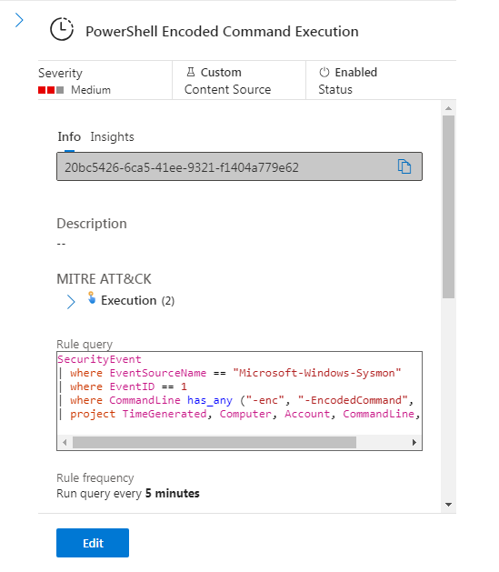
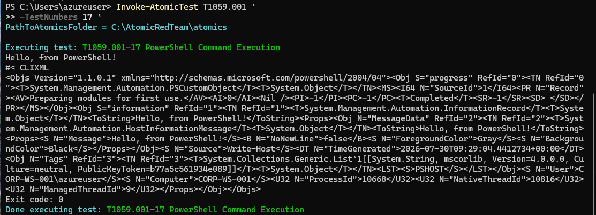
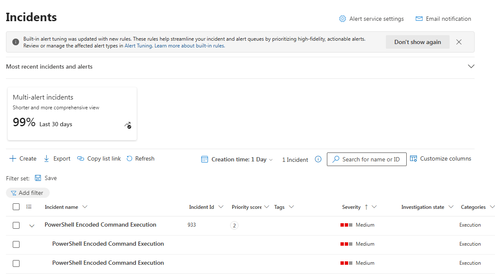
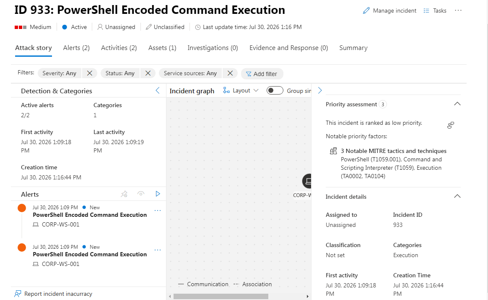
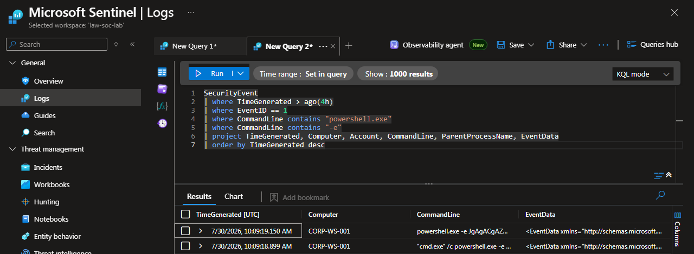
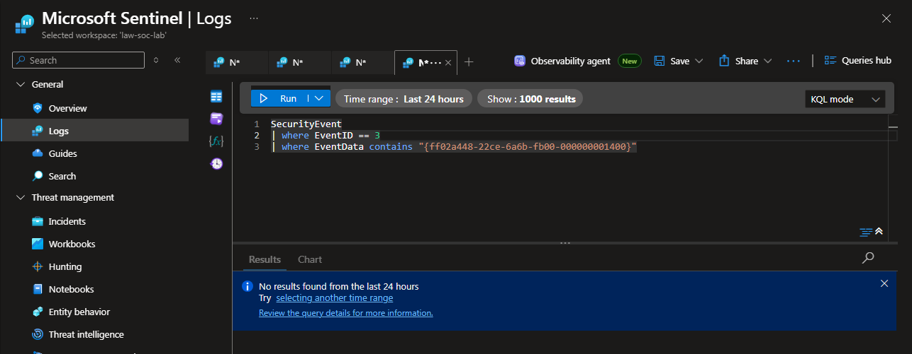
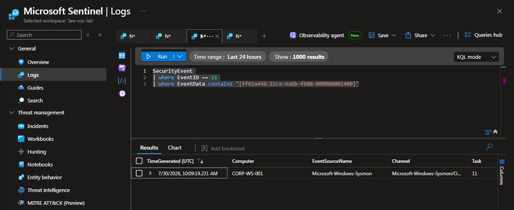

# Case 001: PowerShell Encoded Command Execution 
---

## Scenario
This case demonstrates the investigation of a Microsoft Sentinel alert triggered by an encoded PowerShell command executed during an authorized Atomic Red Team simulation.
The objective was to validate the detection, analyze Sysmon telemetry, and determine whether the activity represented malicious behavior or legitimate security testing.

## Executive Summary

Microsoft Sentinel generated an alert after detecting an encoded PowerShell command.
The investigation confirmed that the activity originated from an authorized Atomic Red Team simulation.
No malicious execution, persistence, or outbound network communication was observed.
The incident was classified as a Benign True Positive.

## MITRE ATT&CK Mapping

| Tactic | Technique |
|---|---|
| Execution | T1059.001 — PowerShell |

## Lab Environment

| Component | Value |
|---|---|
| SIEM | Microsoft Sentinel |
| Telemetry | Sysmon v15 |
| Log Collection | Azure Monitor Agent |
| Host | CORP-WS-001 |
| Simulation | Atomic Red Team |
| Detection | Scheduled Analytics Rule |

---


## Timeline

| Time (UTC) | Event | Source |
|------------|-------|--------|
| Jul 30, 2026 13:09:18 | Encoded PowerShell execution detected | Sysmon Event ID 1 |
| Jul 30, 2026 13:16:44 | Alert generated | Microsoft Sentinel |
| Jul 30, 2026 13:16:44 | Incident created | Microsoft Sentinel |

---


## Objectives

- Trigger Sentinel Analytics Rule
- Analyze Sysmon Event ID 1
- Decode Base64 PowerShell command
- Review Sysmon Event ID 3
- Review Sysmon Event ID 11
- Classify incident

---

## Detection Rule

### Objective

Detect encoded PowerShell execution.

### Detection Logic

The rule monitors:

- Sysmon Event ID 1
- PowerShell execution
- Encoded command parameters

Detected command-line parameters:

- `-e`
- `-enc`
- `-EncodedCommand`




### KQL Query


[01-Detection-Rule.kql](./queries/01-Detection-Rule.kql)

---

## Attack Simulation

| Item | Value |
|-|-|
| Framework | Atomic Red Team |
| Technique | T1059.001 |
| Test | Atomic Test #17 |
| Description | PowerShell Command Execution |



---

## Alert Details

| Field | Value |
|-|-|
| Alert | PowerShell Encoded Command Execution |
| Severity | Medium |
| Source | Microsoft Sentinel |
| Host | CORP-WS-001 |


---

## Investigation

### Step 1 — Alert Validation

Microsoft Sentinel generated an alert after execution of an encoded PowerShell command.








---

### Step 2 — Process Analysis

Reviewed Sysmon Event ID 1.

Query:

[02-Process-Creation.kql](./queries/02-Process-Creation.kql)


### Findings

- Encoded PowerShell execution confirmed.
- Parent process identified (`cmd.exe`).
- User successfully identified.
- Process executed with High Integrity.





---

### Step 3 — PowerShell Decoding

Decoded command:

```powershell
Write-Host "Hello, from PowerShell!"
```


Result:

The command executed a simple `Write-Host` statement.

No malicious functionality was identified.

---

### Step 4 — Network Analysis

Reviewed Sysmon Event ID 3.

Query:

[03-Network-Analysis.kql](./queries/03-Network-Analysis.kql)


Result:

No outbound network connections related to the PowerShell process were identified.





---

### Step 5 — File Analysis

Reviewed Sysmon Event ID 11.

Query:

[04-File-Analysis.kql](./queries/04-File-Analysis.kql)


Analysis:

Temporary PowerShell execution policy test file.

No suspicious payloads created.





---

## Evidence Summary

| Evidence | Status |
|----------|--------|
| PowerShell execution | Confirmed |
| Encoded command | Confirmed |
| Base64 command decoded | Completed |
| Parent process identified | Confirmed |
| User identified | Confirmed |
| Elevated execution | Confirmed |
| Outbound network activity | Not Observed |
| Malicious file creation | Not Observed |

## Attack Flow

```text
Atomic Red Team
        │
        ▼
PowerShell (EncodedCommand)
        │
        ▼
Sysmon Event ID 1
        │
        ▼
Azure Monitor Agent
        │
        ▼
Log Analytics Workspace
        │
        ▼
Microsoft Sentinel
        │
        ▼
Analytics Rule
        │
        ▼
Alert
        │
        ▼
Incident
```

---

## Incident Classification

| Field | Result |
|-|-|
| Severity | Low |
| Confidence | High |
| Classification | Benign True Positive |
| Root Cause | Authorized Atomic Red Team Simulation |

## Conclusion

The investigation confirmed that an encoded PowerShell command was successfully executed.
Although the activity matched the detection logic for MITRE ATT&CK technique T1059.001 (PowerShell), further analysis determined that it originated from an authorized Atomic Red Team simulation.
Review of Sysmon telemetry found no evidence of malicious payload execution, persistence, credential access, lateral movement, or outbound network communication.
Based on the collected evidence, the incident was classified as a **Benign True Positive** and no additional response actions were required.

---

## Lessons Learned

- Sysmon Event ID 1 provides process execution visibility.
- Encoded PowerShell commands should always be decoded before classification.
- Sysmon Event ID 3 helps identify outbound network communication.
- Sysmon Event ID 11 helps identify dropped files and payloads.
- Microsoft Sentinel successfully detected the simulated activity.


