# Case 002: SMB Password Spray Detection — NTLM Failed Logons
---

## Scenario
This case demonstrates the investigation of a Microsoft Sentinel alert triggered by an automated SMB password spraying attack performed as part of an authorized internal security infrastructure validation.

The objective was to generate realistic network authentication telemetry using a custom user list, create a Microsoft Sentinel Analytics Rule, and inspect raw Windows Security Event fields (specifically Event ID 4625, Logon Type 3, and SubStatus codes).

## Executive Summary

Microsoft Sentinel generated a Medium-severity alert after detecting an automated SMB Password Spraying pattern targeting a Windows endpoint (`CORP-WS-001`). The investigation reconstructed the attack timeline using Windows Security Event telemetry (`EventID 4625`, `LogonType 3`) and confirmed that the primary high-velocity activity originated from an authorized internal laboratory machine (`10.0.0.5`). 

During the log investigation, two additional failed authentication attempts were observed from a different public IP address (`REDACTED_PUBLIC_IP`), separate from the primary attack source (`10.0.0.5`). 

## MITRE ATT&CK Mapping

| Tactic | Technique |
|---|---|
| Credential Access | T1110.003 — Brute Force: Password Spraying |

## Lab Environment

| Component | Value |
|---|---|
| SIEM | Microsoft Sentinel |
| Telemetry | Windows Security Events (`EventID 4625`) |
| Log Collection | Azure Monitor Agent (AMA) / Log Analytics Workspace |
| Target Host | CORP-WS-001 |
| Attacking Host | Kali Linux (`10.0.0.5`) |
| Simulation | Controlled Network Authentication Spray |
| Detection | Scheduled Analytics Rule (NTLM Failed Logons) |

---


## Timeline

| Time (UTC) | Event | Source |
|---|---|---|
| Aug 11, 2026 16:32:18 | First activity associated with the alert | Microsoft Sentinel |
| Aug 11, 2026 16:47:18 | Last activity associated with the alert | Microsoft Sentinel |
| Aug 11, 2026 16:53:12 | Incident created | Microsoft Sentinel |

> **Important:** Microsoft Sentinel displays incident activity timestamps according to the configured workspace or portal time zone, while the raw Windows Security Event timestamps used in this investigation are represented in UTC. The `First activity` and `Last activity` timestamps displayed on the incident page represent the broader activity window associated with the alert/incident and should not be interpreted as the duration of the Password Spray attack.

### Actual Password Spray Event Sequence

Raw Windows Security Event 4625 telemetry shows that the ten account-targeting events occurred between:

`13:43:40.334` and `13:43:40.560` UTC.

This represents an observed authentication sequence lasting approximately **226 milliseconds**.

The raw event timestamps are therefore used to determine the actual attack velocity, while the incident activity timestamps represent the broader alert activity window.

---

## Objectives

- Trigger a controlled password spray
- Create Microsoft Sentinel Scheduled Analytics Rule for Network Logons
- Review Microsoft Sentinel incident entities
- Analyze Windows Security Event ID 4625 (Failed Logon)
- Inspect low-level authentication failure codes (`Status: 0xc000006d`, `SubStatus: 0xc0000064` / `0xc000006a`)
- Perform source IP analysis and blast radius evaluation
- Classify the incident

  ---

## Detection Rule

### Objective

Detect SMB password spraying attempts using NTLM failed logons across multiple user accounts.

### Detection Logic

The analytics rule monitors Windows Security Logs (`SecurityEvent`) for:
- **Event ID 4625** (Failed Logon)
- **Logon Type 3** (Network Logon)
- **AuthenticationPackageName**: NTLM
- High-velocity failure attempts from a single source IP address across multiple distinct user accounts.

In this case, Logon Type 3 represents network logon activity and, in this case, the observed authentication attempts were associated with SMB network access.


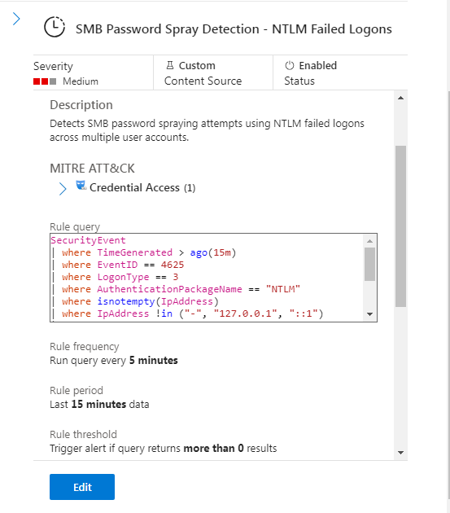

### KQL Query
[01-Detection-Rule.kql](./queries/01-Detection-Rule.kql)


---

## Attack Simulation


| Item| Value |
|---|---|
| Target Service | SMB (Server Message Block) |
| Execution Tool | CrackMapExec |
| Attack Type | Password Spraying |
| Test Strategy | Testing a single popular password against multiple accounts |
|Account and passwords list | one password → many accounts pattern |

### Controlled SMB Password Spray:
**bash**

crackmapexec smb 10.0.0.4 -u /tmp/users.txt -p 'Summer2026!'


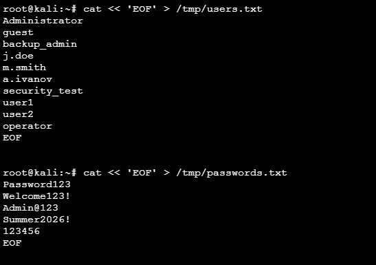
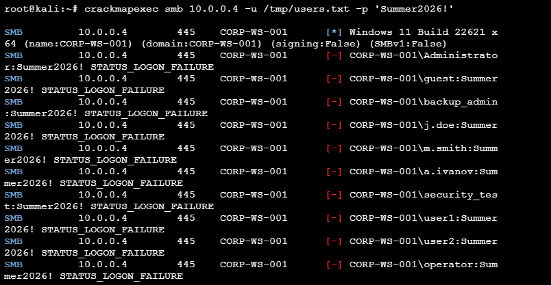

---

## Alert Details

| Field | Value |
|-|-|
| Alert |SMB Password SMB Password Spray Detection — NTLM Failed Logons |
| Severity | Medium |
| Source | Microsoft Sentinel |
| Host | CORP-WS-001 |

---


## Investigation

### Step 1 - Verify Raw 4625 Events
After the attack simulation, verify that the Windows Security Event 4625 logs were successfully ingested into Microsoft Sentinel.

### KQL Query
[02-Verify-Raw-4625-Events.kql](./queries/02-Verify-Raw-4625-Events.kql)


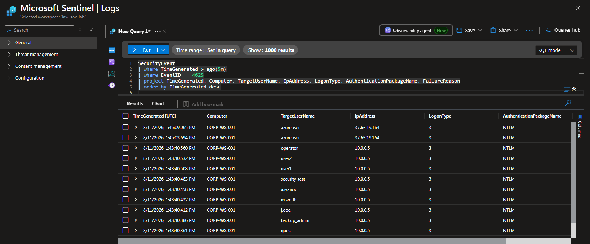


### Step 2 — Incident Validation 

Microsoft Sentinel generated an incident: **SMB Password Spray Detection - NTLM Failed Logons**.

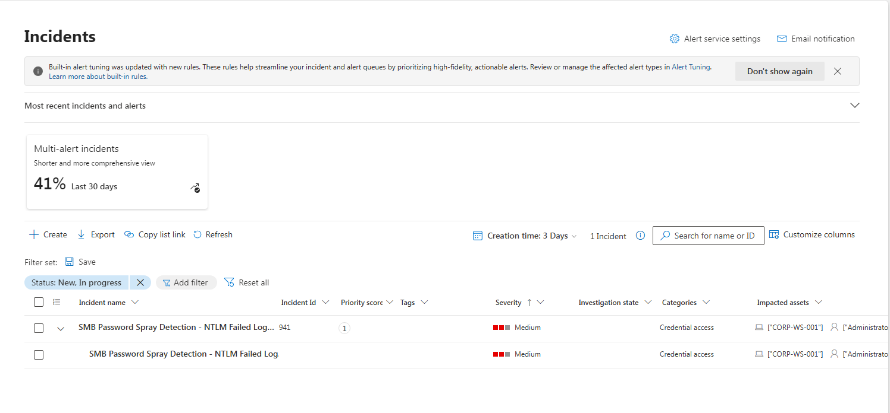
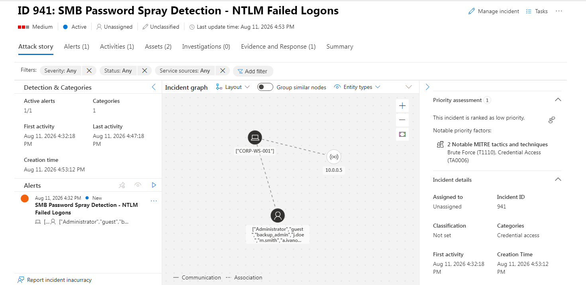
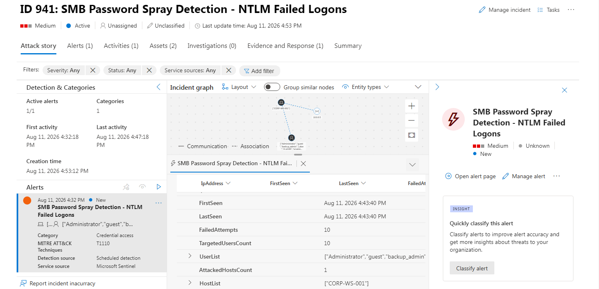

### Findings
IP: 10.0.0.5
Host: CORP-WS-001


### Step 3 — Process Analysis 
### SOC Analyst Triage:General overview of logs for one day (where EventID == 4625 and AuthenticationPackageName has "NTLM")

Purpose: Before focusing exclusively on the current Password Spray incident, I review the broader NTLM authentication-failure activity observed on the affected host during the previous 24 hours. The goal is to distinguish the current laboratory attack from unrelated historical authentication activity.

[03-General-overview-of-logs-for-one-day.kql](./queries/03-General-overview-of-logs-for-one-day.kql)
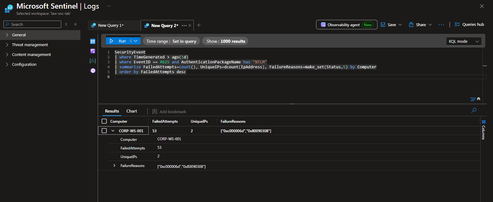

#### Result:

Computer: CORP-WS-001

FailedAttempts: 59 

UniqueIPs: 2 

**FailureReasons:** ["0xc000006d"] (Windows sign-in failure caused by a bad username, incorrect password)

**FailureReasons:** ["0x80090308"] (SEC_E_INVALID_TOKEN): The security token supplied during authentication was invalid or could not be processed.

 
The value 59 represents all matching NTLM authentication failures observed on CORP-WS-001 during the one-day investigation window. As seen in incident page only 10 failed attempts linked to this case.The remaining majority of the failed attempts occurred before the incident was triggered, due to multiple simulated attack attempts executed for tuning a correct detection rule.

### Step 4 - More detailed analysis to detect unique IPs 2:

[04-More-detailed-analysis.kql](./queries/04-More-detailed-analysis.kql)

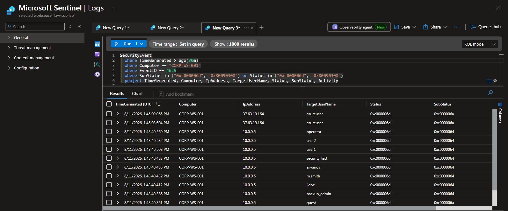

Detailed analysis: Identify distinct two source IPs 

####  Review Detailed analysis 

**Source 1 (Simulated Attack)**
- **Source IP:** `10.0.0.5`
- **Target Host:** `CORP-WS-001`
- **Activity:** Event ID `4625` (Failed Logon)
- **Status:** `0xc000006d` (`STATUS_LOGON_FAILURE`)

### Target Accounts & Automation Timeline [UTC]

Ten accounts were targeted in less than one second, demonstrating a high-velocity automated authentication pattern. 
- **13:43:40.334** — `Administrator`
- **13:43:40.361** — `guest`
- **13:43:40.386** — `backup_admin`
- **13:43:40.412** — `j.doe`
- **13:43:40.432** — `m.smith`
- **13:43:40.458** — `a.ivanov`
- **13:43:40.483** — `security_test`
- **13:43:40.508** — `user1`
- **13:43:40.532** — `user2`
- **13:43:40.560** — `operator`

This pattern is consistent with the controlled password spray:

One source IP → multiple accounts → rapid 4625 failures → NTLM network authentication.

SubStatus context:
- `0xc0000064` (`STATUS_NO_SUCH_USER`) — the specified account could not be found by the target system.
- `0xc000006a` (`STATUS_WRONG_PASSWORD`) — the supplied password was incorrect for the specified account.


**Source 2** — (Additional Authentication Noise)**

The second source `(REDACTED_PUBLIC_I)`) generated two failed authentication attempts against the same azureuser account:

- **Source IP:** `(REDACTED_PUBLIC_I)`
- **Target Host:** `CORP-WS-001`
- **Target Account:** `azureuser`
- **Timeline:** `13:45:03.694` & `13:45:09.065` (Event ID `4625`)
- **Status / SubStatus:** `0xc000006d` / `0xc000006a`


These events were intentionally generated as benign authentication noise, simulating a user entering an incorrect password twice.
The activity does not satisfy the Password Spray detection condition because both failures target the same account:
**One source IP → one account → 2 failed 4625 events → `TargetedUsersCount = 1` → threshold of ≥3 not reached.**

**Analyst interpretation:** The two `azureuser` failures are treated as benign authentication noise in this controlled laboratory scenario rather than Password Spray. This demonstrates why the detection relies on **distinct targeted accounts**, rather than simply counting `4625` events.

### Step 5 - Attack Source IP Analysis & Blast Radius Evaluation

**Purpose:** Pivot directly to the identified attack source IP to verify the horizontal password-spraying pattern, determine the blast radius, and identify the targeted accounts.

[05-Attack-Source-IP-Analysis-&-Blast-Radius-Evaluation.kql](./queries/05-Attack-Source-IP-Analysis-&-Blast-Radius-Evaluation.kql)

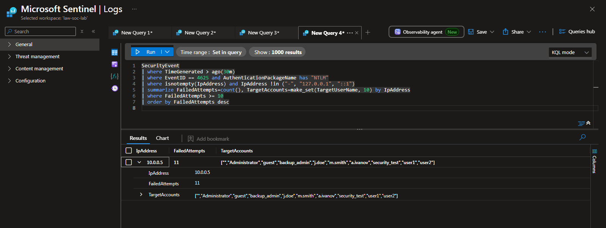

The `>=10` threshold is used for this laboratory investigation to reduce unrelated historical NTLM failures. Production thresholds should be calibrated against the organization's normal baseline.

**Analyst hypothesis:** A successful network logon (EventID == 4624, LogonType == 3) from the identified spray source may indicate that valid credentials were successfully used. However, a single 4624 event does not by itself prove account compromise. The analyst must validate the authentication context, including the targeted account, source IP, authentication package, timing, account privileges, and subsequent activity.
Possible Outcomes & Next Steps:


**Outcome A — No Successful Authentication**

No successful network authentication (`4624`, Logon Type `3`) was observed from `10.0.0.5` during the investigation window. Based on the available telemetry, there is no evidence that the observed password spray resulted in a successful authentication from the identified source.

**Actions:** Continue monitoring the targeted accounts and source IP, document the incident as a **True Positive — Password Spray, No Successful Authentication Observed**, and close or continue the incident according to the organization's response procedure.

**Outcome B — Successful Authentication Observed**

A successful network authentication (`4624`, Logon Type `3`) was observed from the identified spray source, for example against the `j.doe` account. This provides strong evidence that valid credentials were successfully used and significantly increases the likelihood of account compromise. The analyst should immediately validate the full authentication context and investigate subsequent activity.

**Actions:** Escalate for immediate incident response. Review the complete `4624` event and correlate it with the preceding `4625` failures. Determine the affected account's privileges and scope of access, verify whether the account is legitimate for the source host, initiate account containment and credential reset or revocation according to organizational procedures, and investigate subsequent activity on the affected host. Isolate the host when compromise or unauthorized activity is suspected and proceed with live forensic collection where required.

  ### Step 6 - Successful Authentication Check

Run the critical query to establish whether Outcome A or Outcome B occurred

[06-Successful-Authentication-Check.kql](./queries/06-Successful-Authentication-Check.kql)

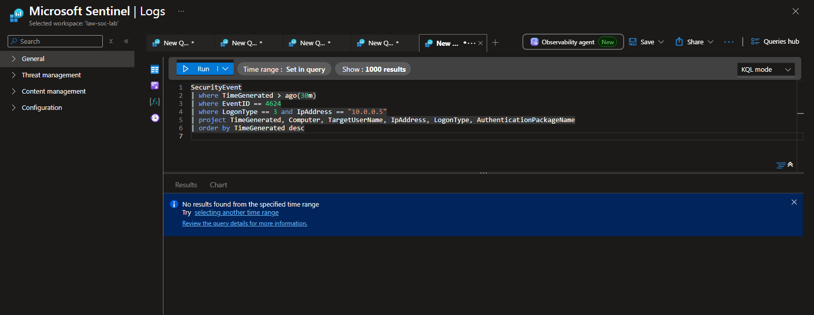

**Lab Result Note:** The query returned 0 rows (Outcome A). No successful network authentication from the identified spray source was observed during the investigation window. 

 Analyst Guidance for Outcome B Triage (If a successful logon is ever found in production):
If a successful 4624 event is detected, immediately pivot to the targeted host and run live triage tools to check the damage:
**Check Active Sessions:** Run Get-SmbSession to see if the attacker is currently connected or downloading assets (NumOpenFiles).

**Inspect Accessed Files:** Run Get-SmbOpenFile to identify exposed sensitive network files or administrative directories (C$, ADMIN$).

**Hunt for Code Execution:** Scan the System event log for Event ID 7045 (New Service Created) to catch post-exploitation tools like psexec or smbexec pushing malicious payloads.


## Evidence Summary

| Evidence Component | Status |
|---|---|
| Password Spraying | Confirmed (10 Accounts targeted) |
| High-Velocity Automation Signature | Confirmed |
| Target User accounts | Completed (`Administrator`, `guest`, etc.) |
| Successful Network Authentication (`4624`) | Not Observed |
| Lateral Movement Attempt | Not Observed |

## Attack Flow

```text
       [ Kali Linux (10.0.0.5) ]
                   │
                   ▼ (NetExec / CrackMapExec)
      [ SMB Password Spray (TCP 445) ]
                   │
                   ▼ 
       [ Windows Host (CORP-WS-001) ]
                   │
                   ▼ (Generates SubStatus 0xc0000064 / 0xc000006a)
       [ Windows Security Event 4625 ]
                   │
                   ▼ 
       [ Azure Monitor Agent (AMA) ]
                   │
                   ▼ 
     [ Log Analytics Workspace (LAW) ]
                   │
                   ▼ 
          [ Microsoft Sentinel ]
                   │
                   ▼ (Scheduled Analytics Rule Checks dcount)
           [ Security Alert ]
                   │
                   ▼ 
         [ Security Incident Created ]


```


## Incident Classification

| Field | Result |
|---|---|
| Severity | Medium |
| Confidence | High |
| Classification | Benign True Positive (Authorized Activity) |
| Root Cause | Controlled Network Authentication Spray Validation |

## Remediation and Response Steps

Although this incident was ultimately classified as a **Benign True Positive** due to the authorized simulation, a standardized response workflow has been documented to support analysts investigating similar network authentication alerts in production environments.

### 1. Immediate Containment

If the SMB Password Spraying activity is determined to be unauthorized or malicious, the following containment actions must be performed immediately:

- Isolate the targeted endpoint (`CORP-WS-001`) from the local network segment using Microsoft Defender for Endpoint (MDE) isolation or network access control lists (ACLs) to prevent any potential lateral movement.
- If any successful login (`EventID 4624`) is observed from the malicious IP, immediately disable or revoke active sessions for the compromised user account.
- Block the attacking source IP address (`10.0.0.5` internally or external public IPs) at the perimeter firewall or local Windows Defender Firewall interface.

---

### 2. Investigation and Eradication

After initial containment, perform deep-dive forensics to identify and remove any persistent threats.

- Inspect the affected endpoint for signs of successful credential dumping (e.g., LSASS parsing, registry hive exports) if any targeted accounts possessed administrative privileges.
- Audit network session logs to verify if the attacker attempted to pivot to other domain resources via SMB/RPC admin shares (`C$`, `ADMIN$`).
- Review additional endpoint telemetry to ensure no persistent malicious services, scheduled tasks, or remote management tools (like PsExec) were installed prior to containment.
- Enforce a mandatory, organization-wide password reset for all targeted accounts if there is a suspicion of dictionary harvesting success.

---

### 3. Post-Incident Hardening & Mitigation

Implement proactive security enhancements to reduce the attack surface against remote credential-guessing campaigns:

- **Network-Level Hardening:** Restrict inbound SMB traffic (TCP Port 445) strictly to trusted domain controllers and administrative management subnets using Windows Firewall:

 **Production consideration:** SMB access should be restricted to required systems and network segments rather than broadly disabling File and Printer Sharing. Firewall rules and network ACLs should allow TCP/445 only where operationally required.
 
- **Disable Legacy Protocols:** Permanently deactivate the obsolete and vulnerable SMBv1 protocol across the entire infrastructure:
 
  Set-SmbServerConfiguration -EnableSMB1Protocol \$false -Force
  
- **Enforce Kerberos & Restrict NTLM:** Transition local network authentication away from legacy NTLM (which is highly vulnerable to spraying and relaying) toward Kerberos. Implement Restrict NTLM policies via Group Policy (GPO).

- **Account Lockout Policies:** Configure robust Account Lockout Thresholds and duration settings to mitigate rapid, vertical brute-force variants without causing massive denial-of-service states across the organization.

---


## Conclusion

The laboratory exercise successfully demonstrated the detection and investigation of an NTLM SMB Password Spray.

The detection identified a single source IP generating failed network logons against multiple distinct accounts within a very short time period. Raw Event ID 4625 telemetry confirmed the authentication pattern, while the source-IP and targeted-account analysis established the spray behavior.

Additional authentication noise was also observed from a separate source IP. Because the noise targeted only one account and did not meet the distinct-account threshold, it did not satisfy the Password Spray detection condition.

A subsequent Event ID 4624 query found no successful network authentication from the identified spray source during the investigation window. Therefore, no successful compromise was observed in the available telemetry.

The investigation demonstrates the importance of correlating failed authentication events by source IP and distinct targeted accounts rather than relying solely on the total number of Event ID 4625 failures.

---

## Lessons Learned

- **Granular Log Analysis:** Windows Security `EventID 4625` combined with `LogonType 3` provides precise visibility into unauthorized remote network authentication attempts (SMB, WMI, PowerShell Remoting).
- **SubStatus Codes Matter:** Inspecting low-level SubStatus codes allows analysts to differentiate between a blind dictionary attack targeting non-existent accounts (`0xc0000064`) and targeted guessing against valid corporate names (`0xc000006a`).
- **Logon Type Distinction:** `LogonType 3` represents a network logon and is commonly associated with services such as SMB, WMI, and WinRM. `LogonType 10` represents a RemoteInteractive logon, typically associated with RDP.
- **Dcount Optimization:** Relying on unique account counts (`dcount(TargetUserName)`) rather than raw event volume is the most effective way to detect horizontal password spraying while suppressing vertical baseline noise.
- **SIEM Validation:** Microsoft Sentinel successfully aggregated high-velocity log data, correctly mapped critical host and IP entities, and triggered a valid alert within the expected execution window.


---

