# Case 003: RDP Password Guessing Detection — Failed Logons Followed by Successful Authentication
---

## Scenario

This case demonstrates the investigation of a controlled RDP password-guessing attack performed against an authorized Windows endpoint in a Microsoft Azure security laboratory.

The objective was to simulate repeated RDP authentication failures from a Kali Linux attacker host, generate Windows Security authentication telemetry, detect the sequence using a Microsoft Sentinel Analytics Rule, and investigate the resulting authentication timeline.

The investigation focused on correlating:

Windows Security Event ID 4625 — failed authentication
Windows Security Event ID 4624 — successful authentication
Logon Type 3 — network authentication
Logon Type 10 — interactive Remote Desktop logon
Event ID 4634 — logoff
Source IP and target account correlation
Microsoft Sentinel incident generation

The case also included post-authentication investigation for process execution, account/group modification, and persistence indicators within the available telemetry.

## Executive Summary

Microsoft Sentinel generated a High-severity incident after detecting multiple failed Windows authentication attempts followed by a successful authentication from the same source IP and user within a 15-minute correlation window.

The controlled attack originated from the authorized Kali Linux laboratory host:

10.0.1.11

The target was:

CORP-WS-001

The targeted account was:

Ragnar

Five failed authentication attempts were observed as Windows Security Event ID 4625, Logon Type 3, using NTLM authentication.

The subsequent successful authentication generated Event ID 4624, Logon Type 3. Approximately one second later, Event ID 4624, Logon Type 10 confirmed the interactive RDP logon.

## MITRE ATT&CK Mapping

| Tactic | Technique |
|---|---|
| Credential Access | T1110.001 — Brute Force: Password Guessing |
| Credential Access / Remote Services | T1021.001 — Remote Services: Remote Desktop Protocol |

## Lab Environment

| Component | Value |
|---|---|
| SIEM | Microsoft Sentinel |
| Telemetry | Windows Security Events (`EventID 4625`) |
| Log Collection | Azure Monitor Agent (AMA) / Log Analytics Workspace |
| Target Host | CORP-WS-001 |
| Attacking Host | Kali Linux (Aktep-02) |
| Simulation | Controlled RDP Password Guessing |
| Detection | Microsoft Sentinel Scheduled Analytics Rule |

---

## Timeline

| Time (UTC)               | Event                                                                     | Source                 |
| ------------------------ | ------------------------------------------------------------------------- | ---------------------- |
| 17 Sep 2026 18:33:11.257 | First failed RDP authentication attempt — Event ID `4625`, Logon Type `3` | Windows Security Event |
| 17 Sep 2026 18:33:13.319 | Second failed authentication — Event ID `4625`, Logon Type `3`            | Windows Security Event |
| 17 Sep 2026 18:33:15.381 | Third failed authentication — Event ID `4625`, Logon Type `3`             | Windows Security Event |
| 17 Sep 2026 18:33:17.444 | Fourth failed authentication — Event ID `4625`, Logon Type `3`            | Windows Security Event |
| 17 Sep 2026 18:33:19.510 | Fifth failed authentication — Event ID `4625`, Logon Type `3`             | Windows Security Event |
| 17 Sep 2026 18:33:57.569 | Successful network authentication — Event ID `4624`, Logon Type `3`       | Windows Security Event |
| 17 Sep 2026 18:33:58.536 | Successful interactive RDP logon — Event ID `4624`, Logon Type `10`       | Windows Security Event |
| 17 Sep 2026 18:33:59.396 | RDP session terminated — Event ID `4634`, Logon Type `10`                 | Windows Security Event |
| 17 Sep 2026 21:44:35     | Microsoft Sentinel incident created/updated                               | Microsoft Sentinel     |

> **Important:** The raw Windows Security Event timestamps used for the authentication timeline are represented in UTC. Microsoft Sentinel displays incident timestamps according to the portal/workspace time-zone context. Therefore, the Sentinel incident timestamp should not be directly compared with the raw UTC event timestamps without accounting for the time-zone difference.

### Actual Authentication Sequence

The raw Windows Security Events establish the following sequence:

`4625 × 5 → 4624 Type 3 → 4624 Type 10 → 4634 Type 10`

The five failed authentication attempts occurred between:

`18:33:11.257` and `18:33:19.510` UTC.

The successful network authentication occurred at:

`18:33:57.569` UTC.

The interactive RDP logon occurred at:

`18:33:58.536` UTC.

The RDP session ended at:

`18:33:59.396` UTC.

The interactive RDP session therefore lasted approximately **0.86 seconds**.

### Sentinel Correlation Window

The Sentinel Analytics Rule recorded:

* **FirstSeen:** `2026-09-17T18:33:11.2572998Z`
* **LastSeen:** `2026-09-17T18:33:57.5693917Z`
* **FailedAttempts:** `5`
* **SuccessfulLogons:** `1`

The `LastSeen` value corresponds to the successful `4624 Type 3` event used by the analytics rule. The subsequent `4624 Type 10` RDP logon occurred approximately **0.97 seconds later**.

Therefore, the Sentinel incident's correlation timestamps should not be interpreted as the complete duration of the RDP session.

---

## Objectives

- Simulate controlled RDP password guessing from an authorized Kali Linux host
- Generate Windows Security Event ID 4625
- Confirm successful authentication with Event ID 4624
- Confirm interactive RDP logon using Logon Type 10
- Create and validate a Microsoft Sentinel Analytics Rule
- Correlate failed and successful authentication attempts
- Investigate the resulting Sentinel incident
- Verify the source IP and target account
- Investigate post-authentication process execution
- Check for account/group modification
- Check for service and scheduled-task persistence
- Document telemetry limitations and investigation findings

## Lab Preparation and RDP Validation

Before generating the authentication attack sequence, the RDP service and network connectivity were validated from both the Windows target and the authorized Kali Linux attacker host.

The validation was performed in the following order:

1. Verify Remote Desktop Services
2. Verify that RDP is enabled
3. Verify Windows Firewall configuration
4. Test RDP connectivity from the current attacker VM
5. Verify TCP/3389 connectivity using Nmap
6. Establish a legitimate RDP session using `xfreerdp`

---

### Step 1 — Verify Remote Desktop Services

The Windows Remote Desktop Services service was checked using:

```cmd
sc query TermService
```

#### Observed State

```text
STATE              : 4  RUNNING
```

`TermService` is the Windows Remote Desktop Services service responsible for handling incoming RDP connections.

This confirms that the RDP service is running on the target endpoint.

---

### Step 2 — Verify RDP Is Enabled

The Windows Terminal Services configuration was checked using:

```cmd
reg query "HKLM\SYSTEM\CurrentControlSet\Control\Terminal Server" /v fDenyTSConnections
```

#### Observed Result

```text
HKEY_LOCAL_MACHINE\SYSTEM\CurrentControlSet\Control\Terminal Server
    fDenyTSConnections    REG_DWORD    0x0
```

A value of `0x0` indicates that RDP connections are permitted by the Windows Terminal Services configuration.

This confirms that Remote Desktop is enabled at the operating system level.

---

### Step 3 — Verify Windows Firewall

The Windows Defender Firewall Remote Desktop rules were inspected using PowerShell:

```powershell
Get-NetFirewallRule -DisplayGroup "Remote Desktop"
```

The relevant inbound TCP rule was observed as enabled:

```text
RemoteDesktop-UserMode-In-TCP
Enabled: True
Direction: Inbound
Action: Allow
Protocol: TCP
Port: 3389
```
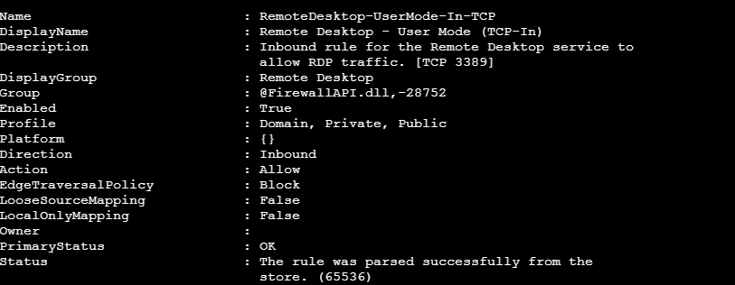

This confirms that the Windows Firewall configuration permits inbound RDP traffic on TCP/3389.

---

### Step 4 — Verify TCP/3389 Connectivity from Kali

The first network-level validation against the Windows target was performed from the Kali Linux attacker host.

#### Install Nmap

```bash
sudo apt update && sudo apt install -y nmap
```

#### Port Scan

```bash
nmap -Pn -p 3389 10.0.1.10
```

#### Observed Result

```text
PORT     STATE SERVICE
3389/tcp open  ms-wbt-server
```
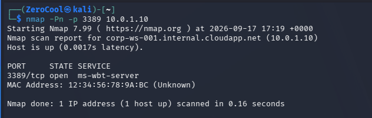

The result confirms that TCP/3389 is reachable on `CORP-WS-001` and that the target is exposing the Microsoft RDP service.

---

### Step 5 — Establish a Legitimate RDP Session

After TCP/3389 connectivity was confirmed, the RDP client was launched from the Kali graphical environment.

#### Install FreeRDP

```bash
sudo apt update && sudo apt install -y freerdp3-x11
```

#### RDP Connection

```bash
xfreerdp /v:10.0.1.10 /u:Ragnar
```

The valid password for the authorized `Ragnar` account was used to establish a legitimate RDP session.

The successful RDP connection served as the final service and authentication validation before generating the controlled password-guessing sequence.

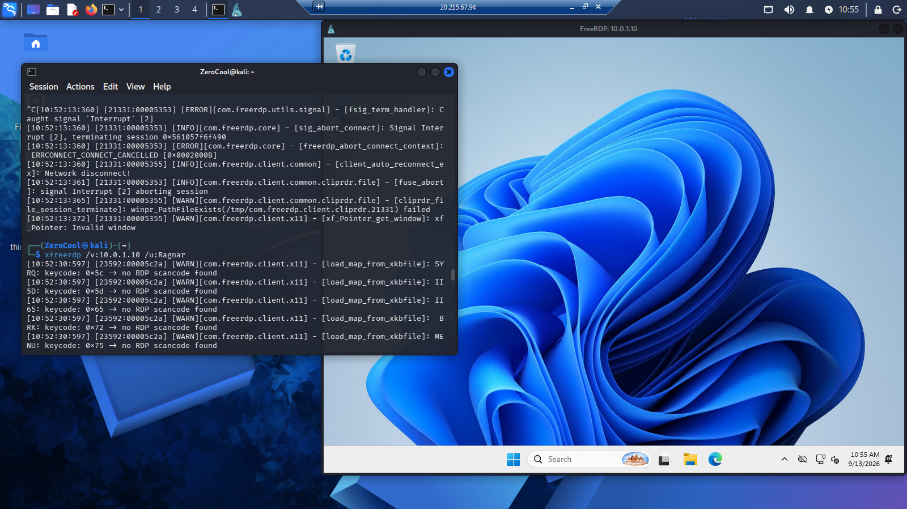

---

### Validation Summary

| Validation                               | Result           |
| ---------------------------------------- | ---------------- |
| Remote Desktop Services (`TermService`)  | Running          |
| RDP configuration (`fDenyTSConnections`) | Enabled          |
| Windows Firewall                         | TCP/3389 allowed |
| Target IP                                | `10.0.1.10`      |
| RDP Port                                 | `3389/tcp`       |
| RDP Service                              | `ms-wbt-server`  |
| Legitimate RDP Session                   | Successful       |
| Target Account                           | `Ragnar`         |

The target was therefore confirmed to be correctly configured and reachable over RDP before the authentication attack simulation was executed.

## Creation wordlist 

nano ~/rdp-passwords.txt

Put:
111111111111
2222222222222
333333333333
444444444444

Check:
cat ~/rdp-passwords.txt


## Creation of a Custom Atomic Test

The RDP password-guessing simulation was implemented as a custom Atomic-style test mapped to MITRE ATT&CK technique `T1110.001 — Brute Force: Password Guessing`.

[T1110.001-rdp-password-guessing.yml](./atomic/T1110.001-rdp-password-guessing.yml)

The test accepts the target IP address and username as input arguments and executes five sequential authentication attempts using intentionally invalid passwords.


### Execution Command

The test was executed manually on `Aktep-02` using:

```bash
for pass in "111111111111" "2222222222222" "333333333333" "444444444444" "555555555555"; do
  echo "[T1110.001] Attempting RDP authentication with password: $pass"
  xfreerdp /v:10.0.1.10 /u:Ragnar /p:"$pass" /cert:ignore /timeout:5000
  sleep 2
done
```

### Observed Result

The execution generated five failed authentication events on `CORP-WS-001`.

* Event ID: `4625`
* Logon Type: `3` (Network)
* Username: `Ragnar`
* Source IP: `10.0.1.11`
* Target IP: `10.0.1.10`
* Failed attempts: `5`

The resulting events were ingested into the `SecurityEvent` table and subsequently correlated by the Microsoft Sentinel analytics rule:

`RDP Multiple Failed Logons Followed by Successful Authentication`

This provided the failed-authentication sequence required to validate the detection logic for `T1110.001`.


## Analytics Rule

The Microsoft Sentinel Analytics Rule was designed to detect a laboratory authentication pattern consisting of:

`multiple failed authentication attempts → successful authentication`

The detection correlates authentication events from the same source IP and username within a 15-minute window.

> **Implementation note:** The rule uses Windows `LogonType == 3` events for correlation. In the observed RDP authentication sequence, the failed attempts were recorded as Event ID `4625`, Logon Type `3`, followed by a successful Event ID `4624` Logon Type `3` and then an interactive RDP Event ID `4624` Logon Type `10`. Therefore, the rule detects the authentication sequence preceding and associated with the RDP session rather than relying exclusively on Logon Type `10`.

### Rule Configuration

| Parameter                  | Value                                                                                                                                                       |
| -------------------------- | ----------------------------------------------------------------------------------------------------------------------------------------------------------- |
| Name                       | `RDP Multiple Failed Logons Followed by Successful Authentication`                                                                                          |
| Description                | Detects multiple failed Windows authentication attempts followed by a successful authentication from the same source IP and user within a 15-minute window. |
| MITRE ATT&CK               | Credential Access — `T1110.001`                                                                                                                             |
| Severity                   | High                                                                                                                                                        |
| Status                     | Enabled                                                                                                                                                     |
| Target Computer            | `CORP-WS-001`                                                                                                                                               |
| Minimum Failed Attempts    | `4`                                                                                                                                                         |
| Required Successful Logons | `1`                                                                                                                                                         |
| Correlation Window         | `15 minutes`                                                                                                                                                |

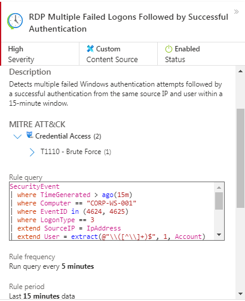


### KQL Query
[01-Detection-Rule.kql](./queries/01-Detection-Rule.kql)
                                     |

### Detection Logic

The rule performs the following correlation:

1. Queries Windows authentication events from `CORP-WS-001`.
2. Limits the event set to Event IDs `4624` and `4625`.
3. Limits the correlation to `LogonType == 3`.
4. Extracts the source IP address from `IpAddress`.
5. Extracts the username from the `Account` field.
6. Groups events by source IP and username.
7. Counts failed authentication events (`4625`).
8. Counts successful authentication events (`4624`).
9. Records the first and last observed timestamps.
10. Generates a result when at least `4` failed attempts and `1` successful authentication are observed within the 15-minute query window.

## Attack Simulation

| Item                    | Value                                                             |
| ----------------------- | ----------------------------------------------------------------- |
| Target Service          | RDP (Remote Desktop Protocol)                                     |
| Execution Tool          | `xfreerdp`                                                        |
| Attack Type             | Password Guessing                                                 |
| MITRE ATT&CK            | `T1110.001 — Brute Force: Password Guessing`                      |
| Execution Host          | `Aktep-02` — Kali Linux (`10.0.1.11`)                             |
| Target Host             | `CORP-WS-001` — Windows 11 Pro (`10.0.1.10`)                      |
| Target Account          | `Ragnar`                                                          |
| Test Strategy           | Multiple intentionally invalid passwords against a single account |
| Attack Pattern          | one account → multiple passwords                                  |
| Authentication Protocol | NTLM                                                              |
| Target Port             | TCP `3389`                                                        |

### Controlled RDP Password Guessing

The attack simulation was performed from `Aktep-02` against the authorized RDP service on `CORP-WS-001`.

Five intentionally invalid passwords were submitted sequentially against the `Ragnar` account:

```bash
for pass in "111111111111" "2222222222222" "333333333333" "444444444444" "555555555555"; do
  echo "[T1110.001] Attempting RDP authentication with password: $pass"
  xfreerdp /v:10.0.1.10 /u:Ragnar /p:"$pass" /cert:ignore /timeout:5000
  sleep 2
done
```

Manual Successful Authentication

After the five failed password-guessing attempts, a successful RDP authentication was performed manually by the lab operator using the valid credentials for the authorized Ragnar account.

---

## Incident 

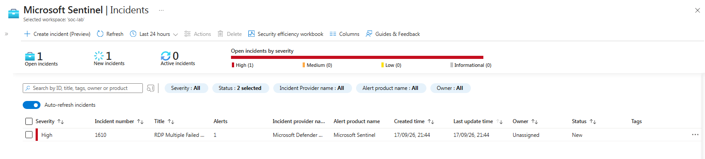
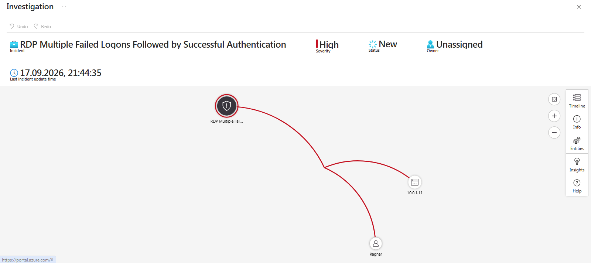
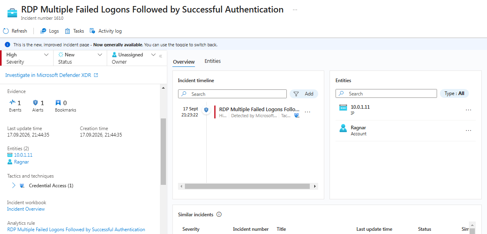


## 14. Investigation

The investigation focused on validating the authentication sequence, identifying the successful RDP session, and determining whether any post-authentication activity was visible in the available Microsoft Sentinel telemetry.

### Step 1 — Reconstruct the Authentication Sequence

The following query was used to retrieve the authentication events generated during the attack window:

[02-Reconstruct-the-Authentication-Sequence.kql](./queries/02-Reconstruct-the-Authentication-Sequence.kql)


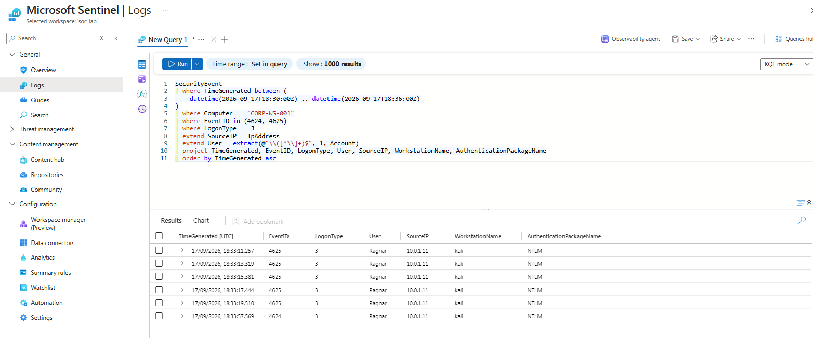

### Observed Authentication Events

| UTC          |  Event | Type | User     | Source      |
| ------------ | -----: | ---: | -------- | ----------- |
| 18:33:11.257 | `4625` |  `3` | `Ragnar` | `10.0.1.11` |
| 18:33:13.319 | `4625` |  `3` | `Ragnar` | `10.0.1.11` |
| 18:33:15.381 | `4625` |  `3` | `Ragnar` | `10.0.1.11` |
| 18:33:17.444 | `4625` |  `3` | `Ragnar` | `10.0.1.11` |
| 18:33:19.510 | `4625` |  `3` | `Ragnar` | `10.0.1.11` |
| 18:33:57.569 | `4624` |  `3` | `Ragnar` | `10.0.1.11` |

The events establish five consecutive failed network authentication attempts followed by a successful network authentication from the same source IP and account.

The failed attempts occurred over approximately **8.25 seconds**, followed by the successful authentication approximately **38.06 seconds** after the first failed attempt.

### Step 2 — Identify the RDP Session Created After Authentication

The next query was used to examine the events immediately surrounding the successful authentication:

[03-identify-the-rdp-session-created-after-authentication.kql](./queries/03-identify-the-rdp-session-created-after-authentication.kql)


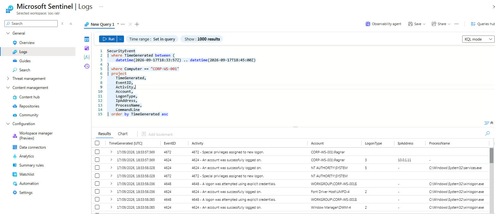


The `4624 / Logon Type 10` event confirms that an interactive RDP session was established after the successful authentication.

The interactive RDP session lasted approximately:

```text
18:33:59.396 - 18:33:58.536 ≈ 0.86 seconds
```

### Step 3 — Check for Other Successful Logons

To determine whether additional successful authentications for the same account and source IP occurred during the investigation window:

[04-successful-logons.kql](./queries/04-successful-logons.kql)


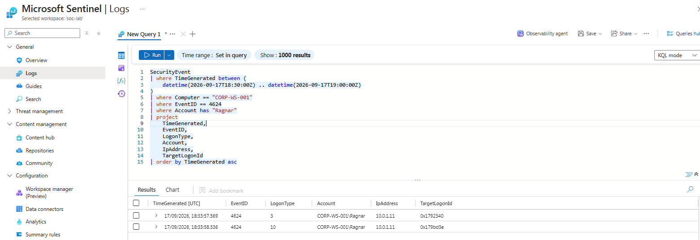

Exactly two successful `4624` events were identified for `Ragnar` from `10.0.1.11` during the `18:30–19:00 UTC` window:

1. `18:33:57.569` — `4624 / Logon Type 3`
2. `18:33:58.536` — `4624 / Logon Type 10`

No additional successful `4624` authentication events for this account/source pair were observed in the specified window.


### Step 4 — Check Process Creation

Because process creation is particularly relevant when determining whether the authenticated session was used to execute commands, Event ID `4688` was queried separately:

[05-check-process-creation.kql](./queries/05-check-process-creation.kql)


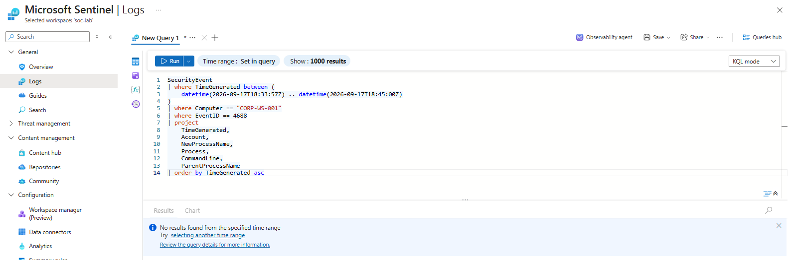


No `4688` process-creation events were observed in the available `SecurityEvent` telemetry during the investigated period.


#### Event ID 4648 — Explicit Credentials

Event ID `4648` was observed at approximately the same time as the RDP session creation.

The event referenced the computer account:

```text
WORKGROUP\CORP-WS-001$
```

and occurred in the context of Windows system components involved in session establishment.

This event should not be interpreted as evidence that the authenticated user manually executed a command using explicit credentials.

#### Event ID 4798 — Local Group Membership Enumeration

Event ID `4798` was also observed during the RDP session establishment sequence.

The events occurred immediately after authentication and were associated with Windows session initialization.

There is no evidence in the available telemetry that the user manually executed a command such as `net localgroup` to generate these events.

Therefore, these events are treated as **system/session initialization activity**, not as evidence of post-authentication attacker activity.

### Step 5 — Check Account and Group Modification

The following query was used to identify account and group manipulation after the successful authentication:

[05-check-process-creation.kql](./queries/05-check-process-creation.kql)

No account or group modification events were observed in the investigated window.

The following potentially relevant operations were therefore not observed:

* account creation;
* account enable/disable;
* password reset;
* account deletion;
* addition/removal from security groups;
* account modification;
* account lockout.

### Step 6 — Check Persistence Through Services and Scheduled Tasks

Potential persistence mechanisms involving services and scheduled tasks were also checked:

[06-check-persistence-through-services-and-scheduled-tasks.kql](./queries/06-check-persistence-through-services-and-scheduled-tasks.kql)

No events associated with service installation or scheduled-task creation/modification were observed in the available telemetry.

This means that no evidence of persistence through the queried Windows service or Scheduled Task event IDs was identified during the investigation window.

### Step 7 — Verify Session Termination

The final authentication/session query was used to confirm how the RDP session ended:

[07-verify-session-termination.kql](./queries/07-verify-session-termination.kqll)


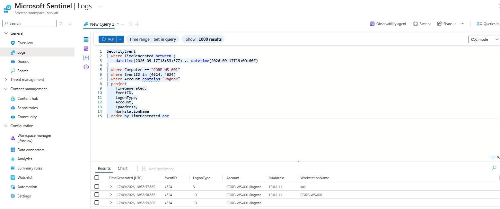

The final session sequence was:

| UTC            |  Event | Logon Type | Interpretation                                     |
| -------------- | -----: | ---------: | -------------------------------------------------- |
| `18:33:57.569` | `4624` |        `3` | Successful network authentication from `10.0.1.11` |
| `18:33:58.536` | `4624` |       `10` | Successful interactive RDP logon                   |
| `18:33:59.396` | `4634` |       `10` | RDP session terminated                             |

### Investigation Summary

The investigation established the following authentication chain:

```text
Aktep-02
10.0.1.11
     |
     | RDP / TCP 3389
     v
CORP-WS-001
10.0.1.10
     |
     +--> 4625 Type 3 × 5
     |    Failed authentication
     |
     +--> 4624 Type 3
     |    Successful network authentication
     |
     +--> 4624 Type 10
     |    Interactive RDP logon
     |
     +--> 4634 Type 10
          Session terminated
```

The complete observed sequence was:

```text
5 × 4625 Type 3
        ↓
4624 Type 3
        ↓
4624 Type 10
        ↓
4634 Type 10
```

The five failed authentication attempts were generated by the controlled password-guessing test. The subsequent successful authentication was performed manually by the lab operator using the valid `Ragnar` credentials to validate the complete detection scenario.

No additional successful `4624` events for `Ragnar` from `10.0.1.11` were observed during the `18:30–19:00 UTC` investigation window.

No `4688` process-creation events, account/group modification events, or queried persistence events were observed in the available `SecurityEvent` telemetry after the successful authentication.

The observed `4648` and `4798` events occurred during session establishment and do not, by themselves, demonstrate manual command execution or malicious post-authentication activity.

Overall, the available telemetry supports the conclusion that the laboratory scenario successfully reproduced the intended authentication pattern and that Microsoft Sentinel detected the sequence of multiple failed authentications followed by a successful authentication.

## Attack Flow

```text
       [ Kali Linux / Aktep-02 ]
              (10.0.1.11)
                   │
                   ▼ (xfreerdp)
      [ RDP Password Guessing ]
             (TCP 3389)
                   │
                   ▼
       [ Windows Host / CORP-WS-001 ]
              (10.0.1.10)
                   │
                   ▼
      [ Windows Security Event 4625 ]
        LogonType 3 / NTLM
        Failed Authentication ×5
                   │
                   ▼
       [ Azure Monitor Agent (AMA) ]
                   │
                   ▼
     [ Log Analytics Workspace (LAW) ]
                   │
                   ▼
          [ Microsoft Sentinel ]
                   │
                   ▼
      [ Scheduled Analytics Rule ]
      Failures >= 4 + Success >= 1
                   │
                   ▼
           [ Security Alert ]
                   │
                   ▼
       [ Security Incident Created ]
                   │
                   ▼
    [ Manual Valid RDP Authentication ]
                   │
                   ▼
       [ 4624 Type 3 → 4624 Type 10 ]
                   │
                   ▼
          [ 4634 Type 10 ]
       Session Termination
```

> **Validation note:** The five failed authentication attempts were generated by the controlled `xfreerdp` password-guessing test. The subsequent successful authentication was performed manually by the laboratory operator using valid `Ragnar` credentials to validate the complete detection and investigation workflow. The successful login was not generated by the password-guessing test itself.

---

## Incident Classification

| Field                     | Result                                       |
| ------------------------- | -------------------------------------------- |
| Severity                  | High                                         |
| Confidence                | High                                         |
| Classification            | Benign True Positive (Authorized Activity)   |
| Root Cause                | Controlled RDP Password Guessing Validation  |
| MITRE ATT&CK              | `T1110.001 — Brute Force: Password Guessing` |
| Source IP                 | `10.0.1.11`                                  |
| Target Host               | `CORP-WS-001`                                |
| Target Account            | `Ragnar`                                     |
| Failed Attempts           | 5                                            |
| Successful Network Logons | 1                                            |
| Interactive RDP Logons    | 1                                            |
| Authentication Protocol   | NTLM                                         |

The alert represents a **true positive from the detection perspective** because the configured correlation conditions were satisfied: multiple failed authentication attempts followed by a successful network authentication for the same source IP and account within the configured 15-minute window.

The activity itself was authorized laboratory activity and was therefore classified as a **Benign True Positive**.

---

## Remediation and Response Steps

Although this incident was ultimately classified as a **Benign True Positive** because the activity was authorized, a standardized response workflow is documented below for analysts investigating similar RDP authentication attacks in production environments.

### 1. Immediate Containment

If the RDP password-guessing activity is determined to be unauthorized or malicious:

* Isolate the targeted endpoint (`CORP-WS-001`) using Microsoft Defender for Endpoint (MDE) isolation or appropriate network access controls.
* If a successful authentication is associated with the suspected attacker source, investigate and terminate the corresponding active RDP session.
* Disable, lock, or otherwise contain the affected account when credential compromise is suspected, following organizational incident-response procedures.
* Block the malicious source IP at the perimeter firewall, VPN gateway, or other appropriate network-control layer.
* Restrict inbound RDP (`TCP/3389`) to authorized administrative networks, VPN ranges, or approved jump hosts.

---

### 2. Investigation and Eradication

After initial containment, investigate whether the successful authentication resulted in further activity on the endpoint.

* Review Windows Security events surrounding the successful authentication, including `4624`, `4634`, `4672`, and related authentication events.
* Review process-creation telemetry (`Event ID 4688`) and endpoint telemetry for commands or tools executed after the successful RDP logon.
* Investigate account and group modification events, including changes involving privileged groups.
* Review scheduled tasks, services, startup mechanisms, and other persistence locations if endpoint telemetry is available.
* Check for credential-access activity such as LSASS access, credential dumping, or suspicious registry/file access when supported by endpoint telemetry.
* Review lateral-movement activity from the affected host to other systems.
* Reset the affected account's password if successful credential guessing or compromise cannot be ruled out.
* Revoke active sessions and authentication tokens where supported by the identity infrastructure.

---

### 3. Post-Incident Hardening & Mitigation

Implement controls that reduce exposure to remote credential-guessing attacks:

* **Multi-Factor Authentication (MFA):** Require MFA for remote-access workflows wherever supported, with phishing-resistant methods preferred for privileged and high-value accounts.

* **Restrict RDP Exposure:** Do not expose RDP directly to the public Internet when avoidable. Restrict access through VPN, bastion hosts, jump servers, or tightly scoped network ACLs.

* **Network-Level Authentication:** Keep Network Level Authentication (NLA) enabled for RDP to require authentication before the full interactive desktop session is established.

* **Account Lockout / Authentication Policies:** Configure account lockout and authentication-failure policies according to organizational requirements and monitor repeated failures against privileged or sensitive accounts.

* **Privileged Account Protection:** Separate administrative and standard user accounts and enforce strong authentication requirements for privileged identities.

* **Password Security:** Enforce strong, unique passwords and prevent reuse of compromised credentials.

* **Source Restriction:** Limit inbound TCP/3389 access to known administrative networks and approved management hosts.

* **Monitoring:** Maintain Microsoft Sentinel analytics rules for repeated authentication failures followed by successful authentication, with thresholds tuned against the organization's baseline.

* **Endpoint Telemetry:** Collect process-creation and additional endpoint telemetry where possible. In this laboratory, the DCR collected only Windows Security events `4624` and `4625`, which limits post-authentication visibility.

---

## Conclusion

The laboratory exercise successfully demonstrated the detection and investigation of an RDP password-guessing scenario.

The controlled attack was executed from `Aktep-02` (`10.0.1.11`) against the authorized RDP service on `CORP-WS-001` (`10.0.1.10`). Five intentionally invalid passwords were submitted against a single account, `Ragnar`, using `xfreerdp`.

The attack generated five consecutive Windows Security `Event ID 4625` records with `LogonType 3`, originating from the Kali host. The authentication failures occurred between `18:33:11.257` and `18:33:19.510` UTC.

After the failed attempts, the laboratory operator manually authenticated with valid credentials. This produced a successful network authentication (`4624 Type 3`) followed approximately one second later by an interactive RDP logon (`4624 Type 10`). The session subsequently terminated with `4634 Type 10`.

The Sentinel analytics rule correlated the five failed authentication attempts with the successful network authentication from the same source IP and account within the configured 15-minute window. This resulted in a **High-severity Microsoft Sentinel incident** involving source IP `10.0.1.11` and account `Ragnar`.

The investigation did not identify additional successful logons, process-creation events, account or group modifications, or persistence-related events in the available `SecurityEvent` telemetry following the successful authentication.

The final classification was therefore **Benign True Positive (Authorized Activity)**. The detection mechanism functioned as designed, while the investigation also demonstrated the importance of distinguishing the authentication event that triggered the analytic correlation (`4624 Type 3`) from the subsequent interactive RDP logon (`4624 Type 10`).

---

## Lessons Learned

* **Authentication Correlation:** RDP password-guessing detection can be modeled as a sequence of repeated authentication failures followed by a successful authentication from the same source and account.

* **Logon Type Distinction:** `LogonType 3` represents a network logon and was the authentication event used by the Sentinel analytics rule. `LogonType 10` represents a `RemoteInteractive` logon and provided confirmation of the actual interactive RDP session.

* **Password Guessing vs. Password Spraying:** This scenario represents **password guessing (`T1110.001`)** because multiple passwords were tested against a single account. Password spraying would instead involve one or a small number of passwords tested across multiple accounts.

* **Event Sequence Matters:** The observed authentication sequence was:
  `4625 × 5 → 4624 Type 3 → 4624 Type 10 → 4634 Type 10`.

* **Successful Authentication Context:** The successful `4624 Type 3` event satisfied the analytics rule. The following `4624 Type 10` event provided additional evidence that an interactive RDP session was established.

* **Manual Validation:** The successful authentication was deliberately performed by the laboratory operator rather than by the guessing test. Separating attack generation from successful-login validation makes the detection workflow reproducible and avoids incorrectly attributing the valid credentials to the password-guessing simulation.

* **SIEM Validation:** Microsoft Sentinel successfully correlated the authentication events, mapped the source IP and account entities, and generated a High-severity incident.

* **Telemetry Limitations:** The current DCR collects Windows Security events `4624` and `4625`. Therefore, the absence of `4688`, account-modification, or persistence events in the investigation means that no such events were observed in the available `SecurityEvent` telemetry; it does not constitute proof that no endpoint activity occurred.

* **Reusable Detection Model:** The same high-level detection concept can be applied to SSH, SMB, FTP, and web authentication, while the underlying telemetry, event semantics, and service-specific success/failure indicators must be adapted to each protocol.

```


