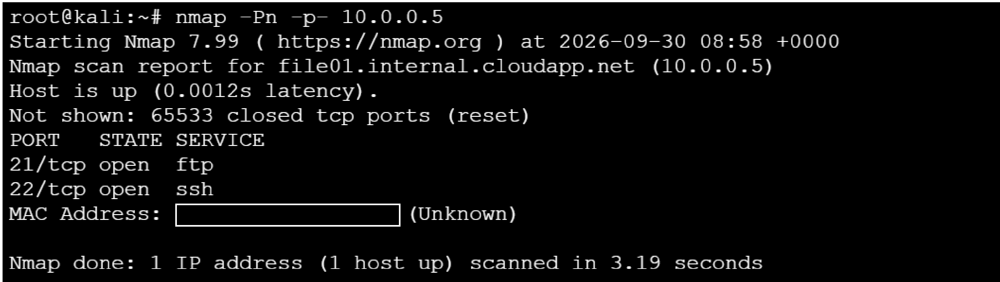
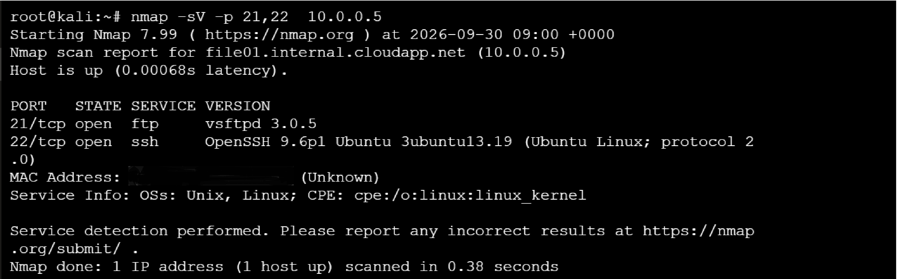
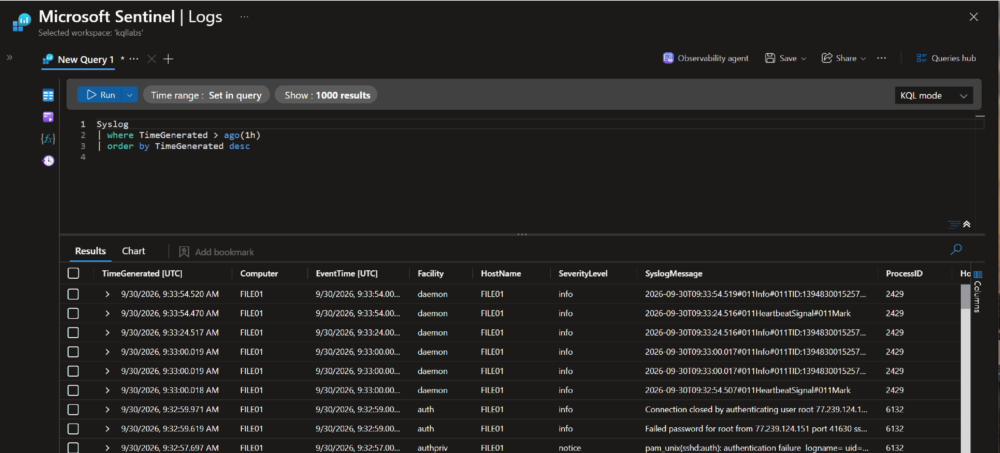
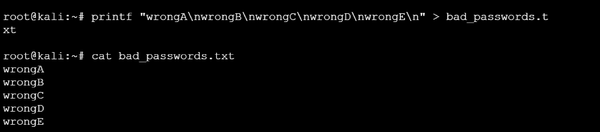
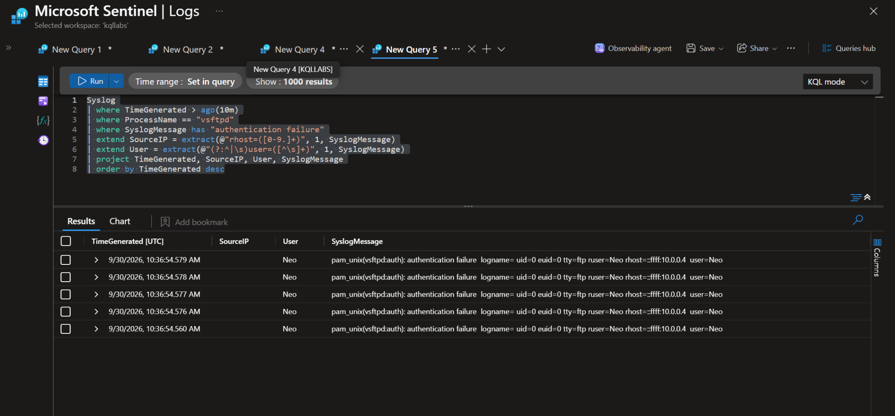
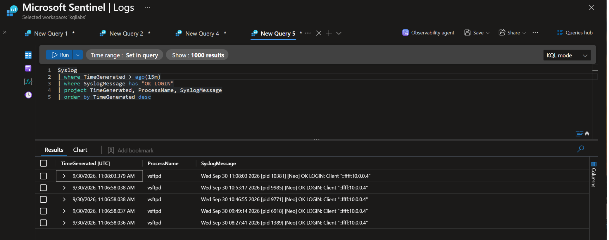

# Case 004: FTP Brute Force Detection — Failed Logons Followed by Successful Authentication

---

## Scenario

This case demonstrates the investigation of a controlled FTP password-guessing attack performed against an authorized Ubuntu endpoint in a Microsoft Azure security laboratory.

The objective was to simulate repeated FTP authentication failures from a Kali Linux attacker host, generate FTP/vsftpd authentication telemetry, detect the sequence using a Microsoft Sentinel Analytics Rule, and investigate the resulting authentication timeline.

The investigation focused on correlating:

* vsftpd log entries — `FAIL LOGIN` events
* vsftpd log entries — `OK LOGIN` events
* Source IP and target account correlation
* Authentication timestamps and event sequence
* Azure Monitor Agent (AMA) log collection
* Microsoft Sentinel incident generation

The case also included post-authentication investigation for subsequent FTP-related activity within the available Syslog telemetry.

## Executive Summary

Microsoft Sentinel generated a **High-severity incident** after detecting multiple failed FTP authentication attempts followed by a successful authentication from the same source IP and user within a five-minute correlation window.

The successful FTP authentication was performed manually by the lab operator as part of the authorized detection validation procedure. The purpose was to verify that Microsoft Sentinel could correlate repeated failed authentication attempts with a subsequent successful login and generate an incident.

The controlled attack originated from the authorized Kali Linux laboratory host:

```text
10.0.0.4
```

The target was:

```text
FILE01
```

The targeted account was:

```text
Neo
```

Five failed authentication attempts were observed as vsftpd `FAIL LOGIN` events.

The subsequent successful authentication generated a vsftpd `OK LOGIN` event. The successful login was recorded at `2026-10-03 11:06:59.988967 UTC`.

The investigation confirmed that the source IP belonged to the authorized Kali Linux laboratory host. Subsequent Syslog analysis did not identify additional FTP-related activity from that source after the successful login. However, the available telemetry did not provide a complete record of FTP commands or file modifications, so the absence of post-authentication activity in Syslog does not establish that no FTP operations occurred.

## MITRE ATT&CK Mapping

| Tactic            | Technique           |
| ----------------- | ------------------- |
| Credential Access | T1110 — Brute Force |

## Lab Environment

| Component      | Value                                               |
| -------------- | --------------------------------------------------- |
| SIEM           | Microsoft Sentinel                                  |
| Telemetry      | Linux Syslog / vsftpd authentication logs           |
| Log Collection | Azure Monitor Agent (AMA) / Log Analytics Workspace |
| Target Host    | `FILE01`                                            |
| Attacking Host | Kali Linux (`10.0.0.4`)                             |
| Target Account | `Neo`                                               |
| FTP Service    | `vsftpd`                                            |
| Simulation     | Controlled FTP Password Guessing                    |
| Detection      | Microsoft Sentinel Scheduled Analytics Rule         |

## Timeline

| Time (UTC)                          | Event                                                                                         | Source             |
| ----------------------------------- | --------------------------------------------------------------------------------------------- | ------------------ |
| 03 Oct 2026 11:06:32.632            | FTP connection activity from `10.0.0.4`                                                       | vsftpd Syslog      |
| 03 Oct 2026 11:06:33.000            | PAM authentication failure events observed during the failed-login sequence                   | Linux Syslog       |
| 03 Oct 2026 11:06:36                | Five failed FTP authentication attempts — `FAIL LOGIN`                                        | vsftpd Syslog      |
| 03 Oct 2026 11:06:49                | Subsequent FTP connection activity from `10.0.0.4`                                            | vsftpd Syslog      |
| 03 Oct 2026 11:06:59.988            | Successful FTP authentication — `OK LOGIN` for `Neo`, performed manually by the lab operator  | vsftpd Syslog      |
| 03 Oct 2026 11:06:59–11:20:00       | Follow-up Syslog investigation; no additional FTP-related activity from `10.0.0.4` identified | Linux Syslog       |
| 03 Oct 2026 14:06–14:11 (UTC+03:00) | Microsoft Sentinel incident time range                                                        | Microsoft Sentinel |
| 03 Oct 2026 14:17 (UTC+03:00)       | Last update time displayed for the Sentinel incident                                          | Microsoft Sentinel |

> **Important:** Raw Syslog timestamps are recorded in UTC. Microsoft Sentinel incident timestamps shown above are in local time (UTC+03:00). The successful FTP authentication was deliberately performed by the lab operator to validate the detection rule; it was not an unauthorized login. 


### Actual Authentication Sequence

The raw vsftpd logs establish the following sequence:

`FAIL LOGIN × 5 → OK LOGIN × 1`

The failed FTP authentication events were recorded at approximately:

`11:06:36 UTC`

The successful FTP authentication was recorded at:

`11:06:59.988967 UTC`

The source IP for both the failed and successful authentication events was:

`10.0.0.4`

The targeted account was:

`Neo`


### Sentinel Correlation Window

Microsoft Sentinel generated an incident using the scheduled Analytics Rule `FTP Brute Force Followed by Successful Login`.

The incident included two entities:

* **IP Address:** `10.0.0.4` — the authorized Kali Linux laboratory host
* **Account:** `Neo` — the targeted FTP account


The Sentinel incident displayed the following timestamps in local time (UTC+03:00):

* **Start Time:** `2026-10-03 14:06`
* **End Time:** `2026-10-03 14:11`
* **Last Update Time:** `2026-10-03 14:17`

The raw FTP authentication logs use UTC timestamps. The successful login was recorded at `2026-10-03T11:06:59.988967Z`, corresponding to `2026-10-03 14:06:59.988967` local time (UTC+03:00).


The incident demonstrates that the Analytics Rule detected the intended authentication sequence and associated the alert with the expected IP and account entities.


---

## Objectives

* Simulate controlled FTP password guessing from an authorized Kali Linux host
* Generate vsftpd `FAIL LOGIN` events
* Confirm successful authentication using the `OK LOGIN` event
* Configure and validate a Microsoft Sentinel Analytics Rule
* Correlate failed and successful authentication attempts
* Create and investigate the resulting Sentinel incident
* Reconstruct the FTP authentication timeline from raw Syslog records
* Investigate subsequent FTP-related activity within the available telemetry
* Document telemetry limitations and investigation findings

## Lab Preparation and FTP Validation

Before generating the authentication attack sequence, the FTP service, logging configuration, and network connectivity were validated on the Ubuntu target and from the authorized Kali Linux attacker host.

### Step 1 — Scan Ports

The vsftpd service was checked on the Ubuntu target using:

```bash
nmap -Pn -p- 10.0.0.5
```

#### Observed State

* PORT   STATE    SERVICE
* 21/tcp filtered ftp
* 22/tcp filtered ssh




---

### Step 2 — Verify Version


```bash
nmap -sV -p 21,22  10.0.0.5
```
#### Observed State

*21/tcp open  ftp  vsftpd 3.0.5
*22/tcp open  ssh  OpenSSH 9.6p1 Ubuntu



---

### Step 3 — Verify FTP Authentication

ftp 10.0.0.5
Use:
Username: 
Password: (incorrect password)

530 Login incorrect.


---

### Step 4 — Verify Local FTP Logs

Target VM FILE-01:

```bash
sudo grep -iE 'vsftpd|authentication failure' /var/log/auth.log | tail -20
```

#### Observed State
2026-09-30T08:27:02.775168+00:00 FILE01 vsftpd: pam_unix(vsftpd:auth): authentication failure; logname= uid=0 euid=0 tty=ftp ruser=root rhost=::ffff:10.0.0.4  user=root

Kali → FTP → vsftpd → PAM → auth.log

### Step 5 Set UP rsyslog

Check:

```bash
sudo grep -RniE 'vsftpd|auth\.|authpriv' \
/etc/rsyslog.conf /etc/rsyslog.d/ 2>/dev/null
```
Got standard configuration:

Neo@FILE01:~$ sudo grep -RniE 'vsftpd|auth\.|authpriv' \
/etc/rsyslog.conf /etc/rsyslog.d/ 2>/dev/null
/etc/rsyslog.d/50-default.conf:8:auth,authpriv.*                        /var/log/auth.log
/etc/rsyslog.d/50-default.conf:9:*.*;auth,authpriv.none         -/var/log/syslog
/etc/rsyslog.d/50-default.conf:29:#     auth,authpriv.none;\
/etc/rsyslog.d/50-default.conf:32:#     auth,authpriv.none;\

### Check rsyslog:

```bash
systemctl status rsyslog
```
Observed State:
Active: active (running)

### Step 5 Create Data Collection Rule

DCR for Linux Syslog.
DCR:
Data sources
→ Linux Syslog

Facility:
auth
authpriv

### Step 6 Verify Sentinel Syslog

### KQL Query

[01-verify-sentinel-syslog.kql](./queries/01-verify-sentinel-syslog.kql)



Ubuntu → AMA → DCR → Log Analytics → Sentinel

A Syslog event generated on FILE-01 was successfully ingested into Microsoft Sentinel, confirming that the Azure Monitor Agent (AMA) and Data Collection Rule (DCR) are collecting and forwarding Linux Syslog data. 


### Step 7 Create Passwords List and run Controlled Attack

```bash
printf "wrongA\nwrongB\nwrongC\nwrongD\nwrongE\n" > bad_passwords.txt
```

Check:

```bash
cat bad_passwords.txt
```



Controlled Attack:

```bash
hydra -l Neo -P bad_passwords.txt ftp://10.0.0.5
```

### Step 8 Check Sentinel Logs

### KQL Query

[02-sentinel-logs.kql](./queries/02-sentinel-logs.kql)

After Hydra got:
SourceIP:  10.0.0.4
User:      Neo
Failures:  5



### Successful login

Performed manual by lab operator after controlled attack.

### KQL Query

[03-successful-login.kql](./queries/03-successful-login.kql)



### Test KQL Query for Analytics Rule

### KQL Query

[04-kql-query-for-analytics-rule.kql](./queries/04-kql-query-for-analytics-rule.kql)

Got:
* SourceIP
* 10.0.0.4
* User Neo
* Failed Attempts 5
* SuccessfulLogins 1

### Step 8 Create Analytics Rule

Sentinel:
Analytics
→ Scheduled query rule

General
Name:
FTP Brute Force Followed by Successful Login

Description:
Detects multiple failed FTP authentication attempts followed by a successful FTP login from the same source IP against the same account.

Severity:
High

Status:
Enabled

MITRE ATT&CK:
Tactic: Credential Access
Technique: T1110 - Brute Force

[04-kql-query-for-analytics-rule.kql](./queries/04-kql-query-for-analytics-rule.kql)


#### Install Nmap

```bash
sudo apt update && sudo apt install -y nmap
```

#### Port Scan

```bash
nmap -Pn -p 21 10.0.0.5
```

#### Observed Result

```text
PORT   STATE SERVICE
21/tcp open  ftp
```

The result confirms that TCP/21 is reachable on `FILE01` and that the target is exposing the FTP service.

---

### Step 5 — Establish a Legitimate FTP Session

After TCP/21 connectivity was confirmed, a legitimate FTP authentication was performed from the authorized Kali Linux laboratory host.

The target was:

```text
10.0.0.5
```

The account used for the validation was:

```text
Neo
```

The successful authentication generated a vsftpd log entry containing:

```text
OK LOGIN: Client "::ffff:10.0.0.4"
```

This confirmed that:

* the FTP service was reachable;
* the `Neo` account could authenticate successfully;
* the source IP was correctly recorded as `10.0.0.4`;
* vsftpd authentication telemetry was being generated;
* the authentication event was available for subsequent ingestion into Microsoft Sentinel.

The legitimate FTP authentication served as the final service and authentication validation before generating the controlled password-guessing sequence.

---

### Validation Summary

| Validation             | Result                |
| ---------------------- | --------------------- |
| vsftpd service         | Running               |
| FTP listening port     | `21/tcp`              |
| FTP service            | `vsftpd`              |
| Target host            | `FILE01`              |
| Target IP              | `10.0.0.5`            |
| Attacking host         | Kali Linux            |
| Attacker IP            | `10.0.0.4`            |
| FTP log                | `/var/log/vsftpd.log` |
| Syslog forwarding      | Configured            |
| Legitimate FTP Session | Successful            |
| Target Account         | `Neo`                 |

The target was therefore confirmed to be correctly configured and reachable over FTP before the authentication attack simulation was executed.

---

## Wordlist Preparation

A custom password wordlist was used on the Kali Linux host containing intentionally incorrect passwords for the initial guessing attempts.

The final successful authentication was then performed manually by the lab operator using the valid `Neo` account credentials.

The objective was to generate the following authentication sequence:

```text
FAIL LOGIN × 5 → OK LOGIN × 1
```

The five failed authentication attempts were generated as part of the controlled laboratory simulation.

The subsequent successful FTP authentication was intentionally performed by the lab operator to validate the Sentinel detection logic.

---

## Creation of a Custom Atomic Test

The FTP password-guessing simulation was implemented as a controlled laboratory test mapped to MITRE ATT&CK technique `T1110 — Brute Force`.

The test generated repeated FTP authentication attempts against the authorized `FILE01` endpoint using the `Neo` account.

The simulation was designed to produce:

* five failed FTP authentication attempts;
* one subsequent successful FTP authentication;
* the same source IP for the failed and successful events;
* the same target account for the failed and successful events.

### Execution

The authentication sequence was generated manually from the authorized Kali Linux laboratory host.

The source host was:

```text
Kali Linux — 10.0.0.4
```

The target was:

```text
FILE01 — 10.0.0.5
```

The target account was:

```text
Neo
```

The successful authentication was intentionally performed manually by the lab operator after the failed attempts.

### Observed Result

The execution generated five failed FTP authentication events followed by one successful authentication event.

* **Failed event:** `FAIL LOGIN`
* **Successful event:** `OK LOGIN`
* **Username:** `Neo`
* **Source IP:** `10.0.0.4`
* **Target IP:** `10.0.0.5`
* **Failed attempts:** `5`
* **Successful logins:** `1`

The resulting events were ingested into the `Syslog` table and subsequently correlated by the Microsoft Sentinel Analytics Rule:

`FTP Brute Force Followed by Successful Login`

The successful authentication was a deliberate laboratory validation step and should not be interpreted as evidence of unauthorized access.

This provided the failed-authentication sequence required to validate the detection logic for `T1110 — Brute Force`.

