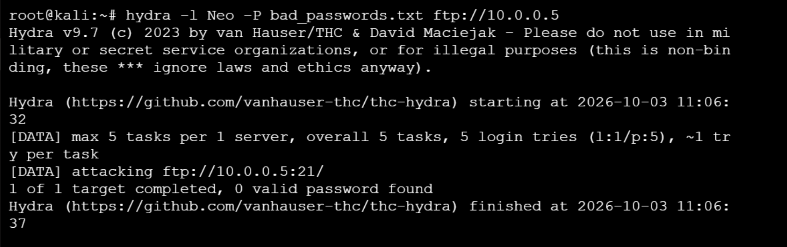
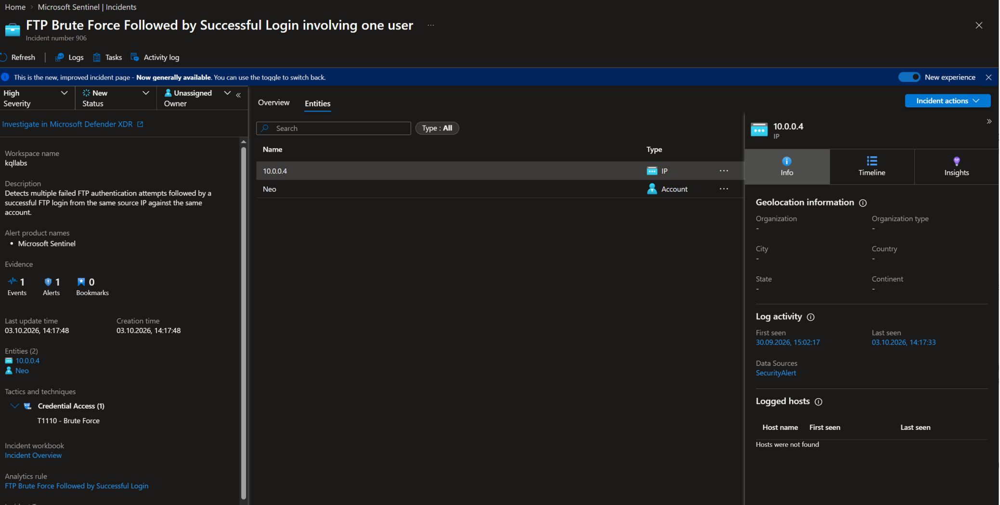
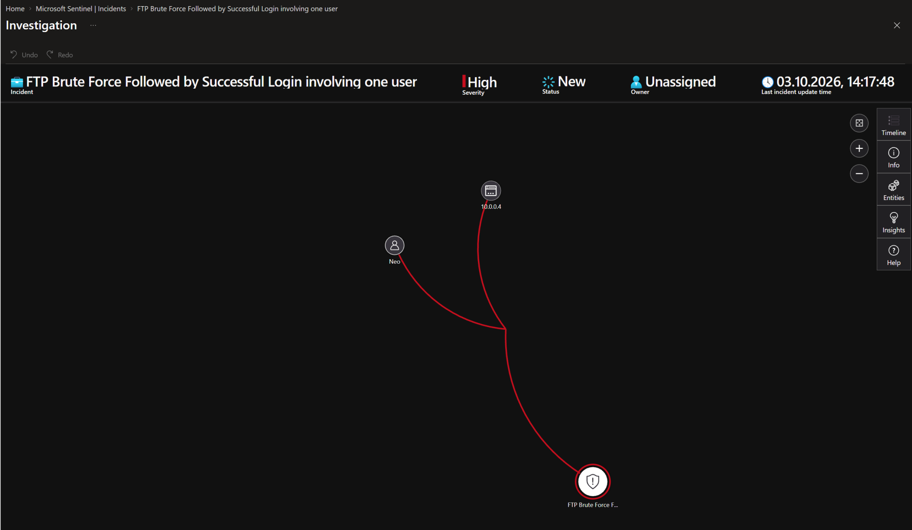
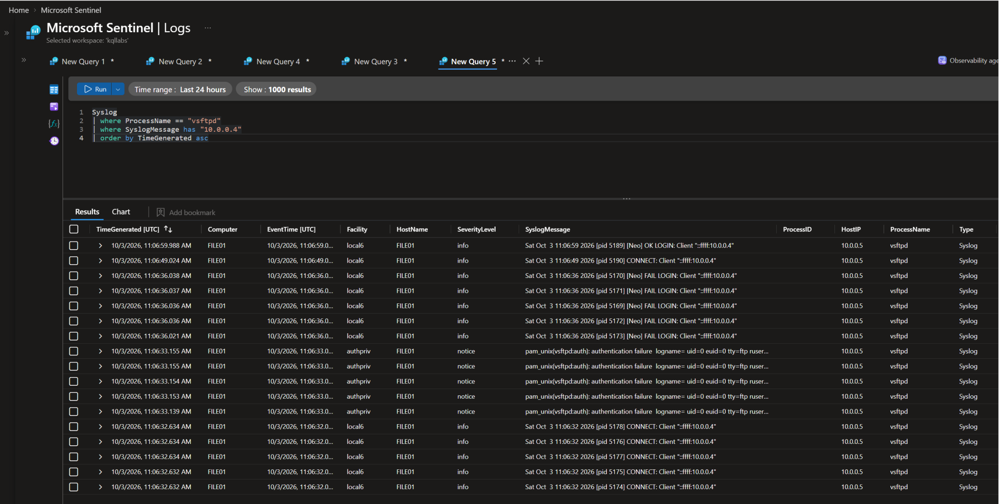
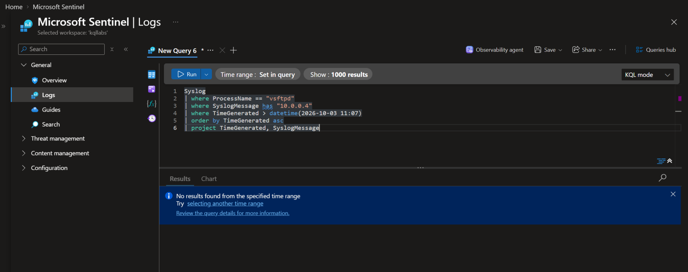
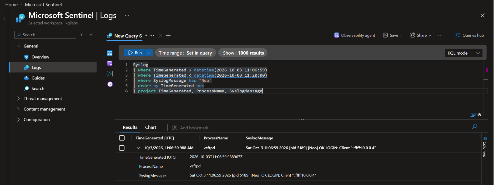
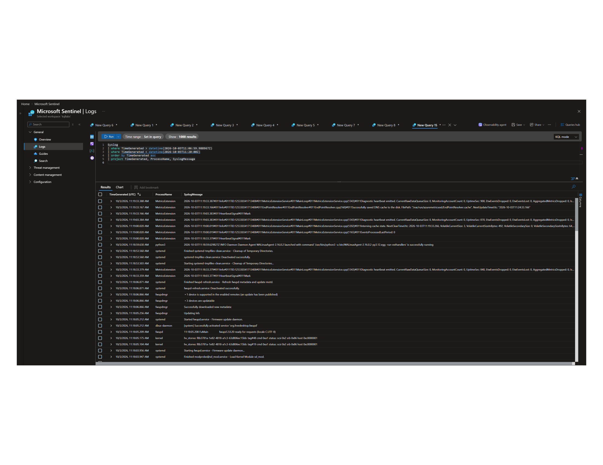

# Case 004: FTP Brute Force Detection — Failed Logons Followed by Successful Authentication

---

## Scenario

This case demonstrates the investigation of a controlled FTP password-guessing attack performed against an authorized Ubuntu endpoint in a Microsoft Azure security laboratory.

The objective was to simulate repeated FTP authentication failures from a Kali Linux attacker host, generate FTP/vsftpd authentication telemetry, detect the sequence using a Microsoft Sentinel Analytics Rule, and investigate the resulting authentication timeline.

The investigation focused on correlating:

* vsftpd log entries — `FAIL LOGIN` events
* vsftpd log entries — `OK LOGIN` events
* Source IP and target account correlation
* Authentication timestamps and event sequence
* Azure Monitor Agent (AMA) log collection
* Microsoft Sentinel incident generation

The case also included post-authentication investigation for subsequent FTP-related activity within the available Syslog telemetry.

## Executive Summary

Microsoft Sentinel generated a **High-severity incident** after detecting multiple failed FTP authentication attempts followed by a successful authentication from the same source IP and user within a five-minute correlation window.

The successful FTP authentication was performed manually by the lab operator as part of the authorized detection validation procedure. The purpose was to verify that Microsoft Sentinel could correlate repeated failed authentication attempts with a subsequent successful login and generate an incident.

The controlled attack originated from the authorized Kali Linux laboratory host:

```text
10.0.0.4
```

The target was:

```text
FILE01
```

The targeted account was:

```text
Neo
```

Five failed authentication attempts were observed as vsftpd `FAIL LOGIN` events.

The subsequent successful authentication generated a vsftpd `OK LOGIN` event. The successful login was recorded at `2026-10-03 11:06:59.988967 UTC`.

The investigation confirmed that the source IP belonged to the authorized Kali Linux laboratory host. Subsequent Syslog analysis did not identify additional FTP-related activity from that source after the successful login. However, the available telemetry did not provide a complete record of FTP commands or file modifications, so the absence of post-authentication activity in Syslog does not establish that no FTP operations occurred.

## MITRE ATT&CK Mapping

| Tactic            | Technique           |
| ----------------- | ------------------- |
| Credential Access | T1110 — Brute Force |

## Lab Environment

| Component      | Value                                               |
| -------------- | --------------------------------------------------- |
| SIEM           | Microsoft Sentinel                                  |
| Telemetry      | Linux Syslog / vsftpd authentication logs           |
| Log Collection | Azure Monitor Agent (AMA) / Log Analytics Workspace |
| Target Host    | `FILE01`                                            |
| Attacking Host | Kali Linux (`10.0.0.4`)                             |
| Target Account | `Neo`                                               |
| FTP Service    | `vsftpd`                                            |
| Simulation     | Controlled FTP Password Guessing                    |
| Detection      | Microsoft Sentinel Scheduled Analytics Rule         |

## Timeline

| Time (UTC)                          | Event                                                                                         | Source             |
| ----------------------------------- | --------------------------------------------------------------------------------------------- | ------------------ |
| 03 Oct 2026 11:06:32.632            | FTP connection activity from `10.0.0.4`                                                       | vsftpd Syslog      |
| 03 Oct 2026 11:06:33.000            | PAM authentication failure events observed during the failed-login sequence                   | Linux Syslog       |
| 03 Oct 2026 11:06:36                | Five failed FTP authentication attempts — `FAIL LOGIN`                                        | vsftpd Syslog      |
| 03 Oct 2026 11:06:49                | Subsequent FTP connection activity from `10.0.0.4`                                            | vsftpd Syslog      |
| 03 Oct 2026 11:06:59.988            | Successful FTP authentication — `OK LOGIN` for `Neo`, performed manually by the lab operator  | vsftpd Syslog      |
| 03 Oct 2026 11:06:59–11:20:00       | Follow-up Syslog investigation; no additional FTP-related activity from `10.0.0.4` identified | Linux Syslog       |
| 03 Oct 2026 14:06–14:11 (UTC+03:00) | Microsoft Sentinel incident time range                                                        | Microsoft Sentinel |
| 03 Oct 2026 14:17 (UTC+03:00)       | Last update time displayed for the Sentinel incident                                          | Microsoft Sentinel |

> **Important:** Raw Syslog timestamps are recorded in UTC. Microsoft Sentinel incident timestamps shown above are in local time (UTC+03:00). The successful FTP authentication was deliberately performed by the lab operator to validate the detection rule; it was not an unauthorized login. 


### Actual Authentication Sequence

The raw vsftpd logs establish the following sequence:

`FAIL LOGIN × 5 → OK LOGIN × 1`

The failed FTP authentication events were recorded at approximately:

`11:06:36 UTC`

The successful FTP authentication was recorded at:

`11:06:59.988967 UTC`

The source IP for both the failed and successful authentication events was:

`10.0.0.4`

The targeted account was:

`Neo`


### Sentinel Correlation Window

Microsoft Sentinel generated an incident using the scheduled Analytics Rule `FTP Brute Force Followed by Successful Login`.

The incident included two entities:

* **IP Address:** `10.0.0.4` — the authorized Kali Linux laboratory host
* **Account:** `Neo` — the targeted FTP account


The Sentinel incident displayed the following timestamps in local time (UTC+03:00):

* **Start Time:** `2026-10-03 14:06`
* **End Time:** `2026-10-03 14:11`
* **Last Update Time:** `2026-10-03 14:17`

The raw FTP authentication logs use UTC timestamps. The successful login was recorded at `2026-10-03T11:06:59.988967Z`, corresponding to `2026-10-03 14:06:59.988967` local time (UTC+03:00).


The incident demonstrates that the Analytics Rule detected the intended authentication sequence and associated the alert with the expected IP and account entities.


---

## Objectives

* Simulate controlled FTP password guessing from an authorized Kali Linux host
* Generate vsftpd `FAIL LOGIN` events
* Confirm successful authentication using the `OK LOGIN` event
* Configure and validate a Microsoft Sentinel Analytics Rule
* Correlate failed and successful authentication attempts
* Create and investigate the resulting Sentinel incident
* Reconstruct the FTP authentication timeline from raw Syslog records
* Investigate subsequent FTP-related activity within the available telemetry
* Document telemetry limitations and investigation findings

## Lab Preparation and FTP Validation

Before generating the authentication attack sequence, the FTP service, logging configuration, and network connectivity were validated on the Ubuntu target and from the authorized Kali Linux attacker host.

### Step 1 — Scan Ports

The vsftpd service was checked on the Ubuntu target using:

```bash
nmap -Pn -p- 10.0.0.5
```

#### Observed State

```text
*21/tcp open  ftp  
*22/tcp open  ssh 
```


---

### Step 2 — Verify Service Versions

A targeted service-version scan was performed against TCP ports 21 and 22:

```bash
nmap -sV -p 21,22 10.0.0.5
```

#### Observed State

```text
21/tcp open  ftp  vsftpd 3.0.5
22/tcp open  ssh  OpenSSH 9.6p1 Ubuntu
```


The scan identified `vsftpd 3.0.5` on TCP/21 and `OpenSSH 9.6p1 Ubuntu` on TCP/22. At the time of this scan, both services were reported as reachable.

---

### Step 3 — Verify FTP Authentication

A manual FTP connection was initiated from Kali Linux:

```bash
ftp 10.0.0.5
```
Username: 
Password: (incorrect password)

An incorrect password was supplied during the authentication test.

#### Observed Result

```text
530 Login incorrect.
```

This confirmed that the FTP service was reachable and returned an authentication failure response.

This was a preliminary authentication validation step, separate from the subsequent controlled Hydra test.

---

### Step 4 — Verify Local FTP Authentication Logs

The Ubuntu target (`FILE01`) was checked for FTP-related PAM authentication events:

```bash
sudo grep -a -iE 'vsftpd|authentication failure' /var/log/auth.log | tail -20
```

#### Observed State

```text
2026-09-30T08:27:02.775168+00:00 FILE01 vsftpd: pam_unix(vsftpd:auth): authentication failure; logname= uid=0 euid=0 tty=ftp ruser=root rhost=::ffff:10.0.0.4 user=root
```

The log entry confirms that the FTP authentication failure was recorded locally on `FILE01`.

The event identifies:

* **Source IP:** `10.0.0.4`
* **Service:** `vsftpd`
* **Authentication mechanism:** PAM
* **Username in this event:** `root`
* **Result:** Authentication failure

This preliminary test used the `root` username. The later controlled Hydra test targeted the `Neo` account.

Authentication flow:

`Kali Linux → FTP → vsftpd → PAM → /var/log/auth.log`

---

### Step 5 — Verify rsyslog Configuration

The existing rsyslog rules were inspected to determine how authentication events were written to local log files:

```bash
sudo grep -RniE 'vsftpd|auth\.|authpriv' \
/etc/rsyslog.conf /etc/rsyslog.d/ 2>/dev/null
```

#### Observed Configuration

```text
/etc/rsyslog.d/50-default.conf:8:auth,authpriv.* /var/log/auth.log
/etc/rsyslog.d/50-default.conf:9:*.*;auth,authpriv.none -/var/log/syslog
```

The configuration directs `auth` and `authpriv` facility messages to `/var/log/auth.log`.

#### Verify rsyslog Service

```bash
systemctl status rsyslog
```

#### Observed State

```text
Active: active (running)
```

This confirmed that rsyslog was running and that the standard authentication logging rules were present.

---

### Step 6 — Configure the Data Collection Rule

A Data Collection Rule (DCR) was configured to collect Linux Syslog events through the Azure Monitor Agent (AMA).

#### DCR Configuration

* **Data source:** Linux Syslog
* **Facilities:** `auth`, `authpriv`
* **Destination:** Log Analytics Workspace associated with Microsoft Sentinel

The selected facilities allow authentication-related Syslog events to be collected for investigation.

---

### Step 7 — Verify Syslog Ingestion in Microsoft Sentinel

The ingestion pipeline was validated by querying the `Syslog` table in the Log Analytics workspace.

#### KQL Query

[01-verify-sentinel-syslog.kql](./queries/01-verify-sentinel-syslog.kql)


A Syslog event generated on `FILE01` was successfully ingested into the workspace.

This confirmed that Linux Syslog data was being collected and forwarded through the configured pipeline:

`Ubuntu → AMA → DCR → Log Analytics Workspace → Microsoft Sentinel`

---

### Step 8 — Prepare the Password List and Execute the Controlled Attack

A custom wordlist containing five intentionally incorrect passwords was created on the Kali Linux host:

```bash
printf "wrongA\nwrongB\nwrongC\nwrongD\nwrongE\n" > bad_passwords.txt
```

#### Verify the Wordlist

```bash
cat bad_passwords.txt
```


#### Execute the Controlled FTP Password-Guessing Test

The authorized test was executed against the laboratory FTP service:

```bash
hydra -l Neo -P bad_passwords.txt ftp://10.0.0.5
```



The test targeted the `Neo` account on `FILE01` from the Kali Linux host.

---

### Step 9 — Verify Failed Authentication Events in Sentinel

The resulting authentication events were queried in Microsoft Sentinel.

#### KQL Query

[02-sentinel-logs.kql](./queries/02-sentinel-logs.kql)


#### Observed Result

* **Source IP:** `10.0.0.4`
* **Target Account:** `Neo`
* **Failed Attempts:** `5`

The query identified five failed FTP authentication events from the same source IP against the same account.

---

### Step 10 — Perform a Manual Successful FTP Login

After the controlled failed-login sequence, the lab operator manually performed a successful FTP authentication using the valid `Neo` account credentials.

This successful login was an intentional validation action used to test whether the detection logic could correlate multiple failed attempts with a subsequent successful authentication.

#### KQL Query

[03-successful-login.kql](./queries/03-successful-login.kql)


The successful authentication generated an `OK LOGIN` event in the vsftpd logs.

---

### Step 11 — Validate the Analytics Rule Query

Before creating the scheduled Analytics Rule, the correlation query was executed manually to verify the expected result.

#### KQL Query

[04-kql-query-for-analytics-rule.kql](./queries/04-kql-query-for-analytics-rule.kql)

#### Observed Result

* **SourceIP:** `10.0.0.4`
* **User:** `Neo`
* **FailedAttempts:** `5`
* **SuccessfulLogins:** `1`

The query correlated the failed and successful authentication events using the same source IP and target account.

This confirmed that the query returned the expected result for the controlled laboratory sequence.

---

### Step 12 — Create the Microsoft Sentinel Analytics Rule

A scheduled query rule was created in Microsoft Sentinel.

#### Rule Configuration

* **Rule name:** `FTP Brute Force Followed by Successful Login`
* **Description:** `Detects multiple failed FTP authentication attempts followed by a successful FTP login from the same source IP against the same account.`
* **Severity:** High
* **Status:** Enabled
* **MITRE ATT&CK tactic:** Credential Access
* **MITRE ATT&CK technique:** T1110 — Brute Force

#### Detection Query

[04-kql-query-for-analytics-rule.kql](./queries/04-kql-query-for-analytics-rule.kql)

The rule was designed to detect repeated failed FTP authentication attempts followed by a successful login from the same source IP and against the same account within the configured correlation window.

The successful login was performed manually by the lab operator and should not be interpreted as an unauthorized compromise.

### Step 13 — Validate the Incident in Microsoft Sentinel

After the controlled attack, Microsoft Sentinel generated an incident based on the Analytics Rule:






### Investigation

#### Verify vsftpd Authentication Timeline

#### KQL Query

[05-vsftpd-authentication-timeline.kql](./queries/05-vsftpd-authentication-timeline.kql)



#### Verify Activity

#### KQL Query

[06-verify-activity-01.kql](./queries/06-verify-activity-01.kql)



#### KQL Query

[07-verify-activity-02.kql](./queries/07-verify-activity-02.kql)



#### KQL Query

[08-verify-activity-03.kql](./queries/08-verify-activity-03.kql)



There are only system events:

* MetricsExtension — Azure heartbeat/metrics;
* systemd — standard systemd services;
* fwupd — firmware metadata updates;
* kernel — hv_storvsc messages related to the Azure virtual disk;
* systemd-tmpfiles-clean — standard `/tmp` cleanup;
* WALinuxAgent — Azure Linux Agent.

These events do not indicate post-exploitation activity, and there are no signs of command execution via FTP in the reviewed events.

#### FTP — Factual Chronology

**11:06:32**
FTP CONNECT from `10.0.0.4`

**11:06:33**
PAM authentication failures

**11:06:36**
5 `FAIL LOGIN` events for `Neo`

**11:06:49**
New FTP CONNECT

**11:06:59.988**
`OK LOGIN` for `Neo`

**After 11:06:59.988**
No further FTP events were observed in the reviewed logs.

### Verify FILE01

```bash id="2a6z0t"
sudo grep -R 'Neo' /var/log/ 2>/dev/null | grep -E 'vsftpd|ftp'
```

```text id="2ydq0w"
/var/log/syslog:2026-10-03T11:06:36.021561+00:00 FILE01 vsftpd: Sat Oct  3 11:06:36 2026 [pid 5173] [Neo] FAIL LOGIN: Client "::ffff:10.0.0.4"
/var/log/syslog:2026-10-03T11:06:36.036330+00:00 FILE01 vsftpd: Sat Oct  3 11:06:36 2026 [pid 5172] [Neo] FAIL LOGIN: Client "::ffff:10.0.0.4"
/var/log/syslog:2026-10-03T11:06:36.036461+00:00 FILE01 vsftpd: Sat Oct  3 11:06:36 2026 [pid 5169] [Neo] FAIL LOGIN: Client "::ffff:10.0.0.4"
/var/log/syslog:2026-10-03T11:06:36.037192+00:00 FILE01 vsftpd: Sat Oct  3 11:06:36 2026 [pid 5171] [Neo] FAIL LOGIN: Client "::ffff:10.0.0.4"
/var/log/syslog:2026-10-03T11:06:36.037859+00:00 FILE01 vsftpd: Sat Oct  3 11:06:36 2026 [pid 5170] [Neo] FAIL LOGIN: Client "::ffff:10.0.0.4"
/var/log/syslog:2026-10-03T11:06:59.988646+00:00 FILE01 vsftpd: Sat Oct  3 11:06:59 2026 [pid 5189] [Neo] OK LOGIN: Client "::ffff:10.0.0.4"
```

In `/var/log/auth.log`, exactly five failed and one successful PAM authentication events were observed:

* **Source:** `10.0.0.4`
* **Account:** `Neo`
* **Service:** `vsftpd`
* **Authentication sequence:** `11:06:36.036330+00:00`–`11:06:59.988646+00:00`

```bash id="u2t4xg"
sudo awk '$0 ~ /2026-10-03T11:06/ && $0 ~ /vsftpd/' /var/log/syslog
```

```text id="0d1h4z"
2026-10-03T11:06:59.988646+00:00 FILE01 vsftpd: Sat Oct  3 11:06:59 2026 [pid 5189] [Neo] OK LOGIN: Client "::ffff:10.0.0.4"
```

For the `11:06` period on `FILE01`, only one `vsftpd` entry was returned by this query:

`11:06:59.988646+00:00 FILE01 vsftpd: Sat Oct  3 11:06:59 2026 [pid 5189] [Neo] OK LOGIN: Client "::ffff:10.0.0.4"`

After the successful authentication, no `STOR`, `RETR`, `DELE`, `MKD`, `RMD`, `LIST`, `CWD`, or similar FTP operation records were observed in the reviewed `vsftpd` logs.

Successful FTP authentication was confirmed, but no subsequent FTP file operations or file modifications were observed on `FILE01`.

### Investigation Summary

The investigation established the following authentication chain:

**Kali Linux**
`10.0.0.4`
↓ FTP / TCP 21
**FILE01**
`10.0.0.5`

* `FAIL LOGIN × 5` — Failed FTP authentication
* `OK LOGIN × 1` — Successful FTP authentication
* PAM authentication events confirmed the same authentication sequence
* No subsequent FTP file operations were observed in the reviewed vsftpd logs

The five failed authentication attempts were generated by the controlled Hydra password-guessing test. The subsequent successful authentication was performed manually by the lab operator using valid `Neo` credentials to validate the complete detection scenario.

The authentication sequence was observed from `11:06:36.036330+00:00` to `11:06:59.988646+00:00`.

Post-authentication activity was reviewed across the available FTP, authentication, Syslog, and system activity sources. No FTP file operations, command execution, or other indicators of post-exploitation activity were identified in the reviewed telemetry.

The observed system events consisted of expected Azure and Linux system activity, including `MetricsExtension`, `systemd`, `fwupd`, `kernel`, `systemd-tmpfiles-clean`, and `WALinuxAgent`.

Overall, the available telemetry supports the conclusion that the laboratory scenario successfully reproduced the intended authentication pattern and that Microsoft Sentinel detected the sequence of multiple failed FTP authentications followed by a successful authentication.

---

## Attack Flow

```text
          [ Kali Linux ]
            (10.0.0.4)
                 │
                 ▼
      [ FTP Password Guessing ]
             (TCP 21)
                 │
                 ▼
            [ FILE01 ]
            (10.0.0.5)
                 │
                 ▼
            [ vsftpd ]
                 │
                 ▼
         [ PAM Authentication ]
                 │
                 ▼
          [ Syslog Events ]
        FAIL LOGIN × 5
                 │
                 ▼
       [ Azure Monitor Agent ]
                 │
                 ▼
     [ Log Analytics Workspace ]
                 │
                 ▼
        [ Microsoft Sentinel ]
                 │
                 ▼
     [ Scheduled Analytics Rule ]
                 │
                 ▼
         [ Security Alert ]
                 │
                 ▼
      [ Security Incident Created ]
                 │
                 ▼
    [ Manual Valid FTP Authentication ]
                 │
                 ▼
          [ OK LOGIN × 1 ]
                 │
                 ▼
      [ Post-Authentication Review ]
                 │
                 ▼
      [ No Suspicious Activity ]
```


## Incident Classification

| Field                    | Result                                      |
| ------------------------ | ------------------------------------------- |
| Severity                 | High                                        |
| Confidence               | High                                        |
| Classification           | Benign True Positive (Authorized Activity)  |
| Root Cause               | Controlled FTP Password Guessing Validation |
| MITRE ATT&CK             | `T1110 — Brute Force`                       |
| Source IP                | `10.0.0.4`                                  |
| Target Host              | `FILE01`                                    |
| Target Account           | `Neo`                                       |
| Failed Attempts          | 5                                           |
| Successful Logins        | 1                                           |
| Protocol                 | FTP                                         |
| Service                  | vsftpd                                      |
| Authentication Mechanism | PAM                                         |

The alert represents a **true positive from the detection perspective** because the configured correlation conditions were satisfied: multiple failed FTP authentication attempts followed by a successful authentication for the same source IP and account within the configured correlation window.

The activity itself was authorized laboratory activity and was therefore classified as a **Benign True Positive**.

---

## Remediation and Response Steps

Although this incident was ultimately classified as a **Benign True Positive** because the activity was authorized, a standardized response workflow is documented below for analysts investigating similar FTP authentication attacks in production environments.

### 1. Immediate Containment

If the FTP password-guessing activity is determined to be unauthorized or malicious:

* Restrict or isolate access to the targeted FTP host using appropriate network controls.
* Investigate the corresponding active FTP session if a successful authentication is associated with the suspected source.
* Contain the affected account when credential compromise is suspected, following organizational incident-response procedures.
* Block the malicious source IP at the appropriate network-control layer.
* Restrict inbound FTP access to authorized source networks.

### 2. Investigation and Eradication

After initial containment, investigate whether the successful authentication resulted in further activity on the endpoint.

* Review `vsftpd`, PAM, Syslog, and authentication logs surrounding the successful authentication.
* Review FTP operation records for commands such as `STOR`, `RETR`, `DELE`, `MKD`, `RMD`, `LIST`, and `CWD`.
* Review available endpoint telemetry for command execution after the successful authentication.
* Investigate account and privilege modification events.
* Review available persistence-related telemetry if endpoint visibility is available.
* Review potential activity from the affected host to other systems.
* Reset the affected account's password if credential compromise is suspected.

### 3. Post-Incident Hardening & Mitigation

Controls that can reduce exposure to remote FTP authentication attacks include:

* **Secure File Transfer:** Prefer SFTP or FTPS instead of unencrypted FTP where supported.
* **Network Restriction:** Limit FTP access to authorized administrative or application networks.
* **Source Restriction:** Restrict inbound TCP/21 access to approved source IP ranges.
* **Authentication Protection:** Use strong, unique passwords and prevent credential reuse.
* **Brute-Force Protection:** Configure appropriate authentication throttling or connection controls where supported.
* **Account Protection:** Avoid using privileged accounts for FTP authentication.
* **Monitoring:** Maintain Microsoft Sentinel analytics rules for repeated authentication failures followed by successful authentication.
* **Endpoint Telemetry:** Collect endpoint telemetry where possible to improve post-authentication visibility.
* **Log Collection:** Maintain centralized collection of `vsftpd`, PAM, Syslog, and authentication events.

---

## Conclusion

The investigation confirmed that the configured Microsoft Sentinel detection successfully correlated repeated FTP authentication failures with a subsequent successful authentication and generated the expected incident.

The primary finding was not simply the presence of failed FTP logons, but the complete authentication sequence and its relationship to the detection logic.

The successful authentication was intentionally introduced as a separate validation step, allowing the detection workflow to be tested end-to-end without treating the controlled password-guessing activity itself as a successful compromise.

Post-authentication activity was reviewed across the available FTP, authentication, Syslog, and system activity sources. No evidence of FTP file operations, command execution, persistence, account modification, or other post-exploitation activity was identified in the reviewed telemetry.

The case therefore validates the complete SOC workflow for this scenario:

**authentication telemetry → correlation → Sentinel incident → investigation → classification → response decision**

The resulting incident was classified as **Benign True Positive (Authorized Activity)**.

---

## Lessons Learned

* **Authentication Correlation:** FTP brute-force detection can be modeled as a sequence of repeated authentication failures followed by a successful authentication from the same source and account.
* **Authentication Timeline:** The five failed `FAIL LOGIN` events occurred before the successful `OK LOGIN` event for the same `Neo` account and source IP.
* **Password Guessing:** This laboratory scenario used multiple incorrect passwords against a single account as part of the controlled FTP authentication test.
* **Successful Authentication Context:** The successful `OK LOGIN` event satisfied the Analytics Rule correlation condition and confirmed the intended detection sequence.
* **SIEM Validation:** Microsoft Sentinel successfully correlated the authentication events, mapped the source IP and account entities, and generated a High-severity incident.
* **Post-Authentication Investigation:** Review of FTP, authentication, Syslog, and system activity did not identify subsequent FTP file operations, command execution, or other indicators of post-exploitation activity.
* **Telemetry Limitations:** The available telemetry provides strong visibility into authentication and system events, but FTP command-level visibility depends on the logging configuration of `vsftpd` and the available endpoint telemetry.


